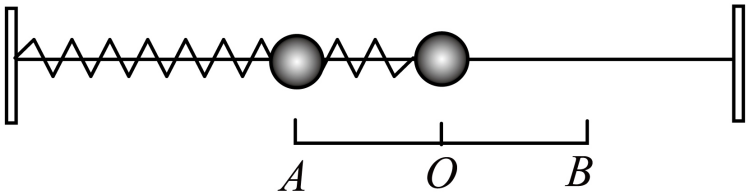

## 讲解

### 是什么

物体在平衡位置附近来回运动叫机械振动。简谐运动是其中一种特定规律：相对平衡位置的位移随时间按正弦或余弦变化。来回运动、有周期，都不足以单独保证“简谐”。

以平衡位置为原点，任选一个正方向，位移用带正负号的 $x$ 表示：

$$x=A\sin(\omega t+\varphi).$$

$A$ 为振幅，单位m；$t$ 单位s；$\omega$ 为角频率，单位rad/s；$\varphi$ 是初相位，记录开始计时时处在振动的哪一个状态。相位每增加 $2\pi$，位置和运动方向一起重复。余弦形式与正弦形式描述同一种运动，只是计时起点不同。

### 怎么来的

动力学入口是回复力。对于光滑水平轻弹簧振子，平衡位置处弹簧为原长；向右移 $x$，弹簧向左拉；向左移，弹簧向右推。胡克定律在所选方向上的表达式为：

$$F=-kx.$$

负号表示力与相对平衡位置的位移反向，$k$ 是正常数，单位N/m。代入牛顿第二定律 $F=ma$，得到：

$$a=-\frac{k}{m}x=-\omega^2x,\qquad \omega^2=\frac{k}{m}.$$

这样，加速度始终指向平衡位置，越远离它，加速度大小越大。物体向平衡位置运动时力做正功，速率增大；穿过平衡位置后，惯性使它继续前进，力改做负功，直到另一端速率降为零再返回。

满足这条线性回复规律的自由振动，位移就按正弦或余弦变化。高中阶段可用匀速圆周运动在直径上的投影理解这个时间规律；正弦函数的二阶变化率正好等于自身乘负的角频率平方，与上式一致，不要求用微积分解方程。

### 什么时候能用

动力学判据是振动方向上的回复力在整个研究范围内满足 $F=-kx$，其中 $k$ 恒定；运动学判据是固定振幅、固定周期的正弦或余弦位移规律。水平理想弹簧振子精确符合该模型，小角度单摆近似符合。

阻力使振幅持续减小、驱动力持续输入能量、弹簧超出弹性限度、接触关系中途改变，都需要重新检查判据。两端弹簧之间存在不受力的自由区时，物体虽会周期性往返，中间却匀速运动，因此不能把整个过程叫简谐运动。

平衡位置、最大位移处和任意普通位置须分开：平衡位置回复力和振动方向加速度为零、速率最大；两端速率为零、回复力和振动方向加速度大小最大。单摆还有法向加速度，不能把这些结论直接改成“总加速度为零”。

## 例题

> 题目与解析：第二章 机械振动（专项训练）（解析版）.docx，来源ID S02，第124—135段。分段选取时保留该子问的完整题干、答案与解析；题目背景和原资料标注照录。

9．（25-26高二上·江西宜春·阶段检测）如图所示，我们将弹簧振子从平衡位置O拉开一段距离到位置B再放开，它会在A、O、B之间做振动。

(1)分别从运动学和动力学的角度来看，如何判定物体的运动是简谐运动呢？

(2)完成1次全振动的时间内，振子运动的路程是多少？$\frac14$周期振子走过的路程等于振幅吗？

(3)弹簧振子系统在振动过程中，有哪些能量在发生变化？一个周期内，这些能量是如何变化的？有什么联系？

**原资料答案：** (1)运动学角度：振子相对平衡位置的位移随时间按正弦或余弦规律变化，动力学角度：回复力与位移大小成正比、方向相反。

(2)一次全振动的路程为振幅的4倍，从最大位移处开始运动时，前四分之一周期内的路程等于振幅，但任意四分之一周期内的路程不一定等于振幅。

(3)动能和弹性势能发生变化，二者周期性地相互转化，理想情况下其总和保持不变。

**原资料详解：** （1）以平衡位置$O$为位移零点。运动学上，若振子相对平衡位置的位移$x$随时间按正弦或余弦规律变化，则振子的运动是简谐运动。动力学上，若振子所受回复力$F$始终指向平衡位置，且回复力大小与位移大小成正比，即满足$F=-kx$，其中$k$为正常数，则振子的运动是简谐运动。

（2）设振幅为$x_m$，则$OB=OA=x_m$，振子从$B$点出发完成一次全振动，依次经过$B\to O\to A\to O\to B$，每一段的路程均为$x_m$，所以一次全振动的路程为$s=4x_m$，本题中振子从最大位移处$B$点由静止释放，前$\frac{T}{4}$内从$B$点运动到平衡位置$O$，路程为$s=BO=x_m$，等于振幅。但若计时起点不是最大位移处或平衡位置，则任意$\frac{T}{4}$内的路程不一定等于振幅。

（3）振子由最大位移处向平衡位置运动时，弹簧形变量减小，弹性势能减小，振子速度增大，动能增大；振子由平衡位置向最大位移处运动时，弹性势能增大，动能减小。在忽略阻力的理想情况下，弹簧振子系统只有弹力做功，系统机械能守恒，即$E=E_k+E_p$

保持不变。因此，一个周期内动能与弹性势能周期性地相互转化：最大位移处弹性势能最大、动能为零，平衡位置处动能最大、弹性势能最小。

### 顺着本题再看清一步

先找原点O，再分别看时间规律与受力规律。原题用 x_m 表示最大位移，也就是本条的A；不是两个不同物理量。第（2）问把一个周期分成四段，每段跨过端点与平衡位置之间的距离，才有4A，不能把任意时间段都按匀速分配路程。

## 易错

- 位移从平衡位置量起，不能把任意选的坐标直接代进回复力判据。
- 同一位置两次经过，速率相等而速度可能反向；一周期路程为4A，净位移为零。
- 例题是水平弹簧振子，弹性势能随离开平衡位置的距离增大；竖直弹簧系统须同时计入重力势能。
