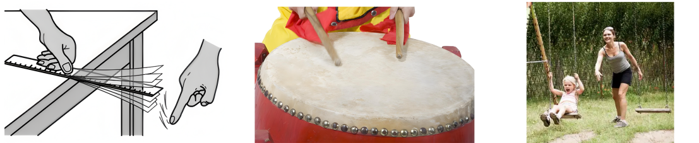

## 讲解

### 是什么

振动系统受阻力等耗能作用，振幅随时间逐渐减小的振动叫阻尼振动。位移仍可来回改变正负，但每次离开平衡位置的最大距离逐渐变小；能量也随之衰减。

振幅 $A$ 单位m，周期 $T$ 单位s，频率 $f$ 单位Hz。振幅减小描述“摆得有多远”，频率描述“往返有多快”，二者不能因为都在同一图中就当作同一量。

### 怎么来的

阻力通常与运动方向相反，因此对系统做负功。根据机械能变化与非保守力做功的关系，研究一次往返：

$$\Delta E_{\text{机械}}=W_{\text{阻力}}<0.$$

对理想水平弹簧振子，端点动能为零，弹性势能为 $kA^2/2$。一轮损失机械能，下一轮到达端点时能转成的势能较少，因此新的振幅较小。损失的机械能转移为内能、声能等，总能量并未消失。

轻微阻尼时，来回运动的节奏可以变化很小，图像的相邻峰间距近似保持，峰高却明显衰减。不能从“声音越来越弱”“摆得越来越小”直接推出频率也在下降。

### 什么时候能用

自由衰减阶段没有持续补充振动能量，才可以用机械能损失解释振幅变小。持续驱动的系统即使有阻尼，也可能达到振幅基本稳定的受迫振动，此时输入能量抵消损耗。

弱阻尼频率可近似等于无阻尼固有频率；一般阻尼会影响频率。若阻尼足够强，系统甚至不再往返振动，而是直接回到平衡位置。此项边界经[阻尼振动模型](https://openstax.org/books/university-physics-volume-1/pages/15-5-damped-oscillations)核对；高中常见图像题主要讨论仍在往返的弱阻尼情形。

## 例题

> 题目与解析：第二章 机械振动（专项训练）（解析版）.docx，来源ID S02，第378—387段。分段选取时保留该子问的完整题干、答案与解析；题目背景和原资料标注照录。

29．（多选）（25-26高一下·湖北武汉·期末）在生活中我们见过很多的与机械振动有关的情形。如图，钢尺的振动为什么会越来越弱？鼓皮的振动为什么会逐渐变弱？荡来荡去的秋千没人推动后，为什么会慢慢停下来。部队过桥时为何不能齐步走？关于这些物理现象下列说法正确的有（     ）

A．钢尺振动逐渐减弱，主要是因为桌面的摩擦力消耗了能量

B．鼓皮的振动逐渐减弱，所以鼓皮的振动频率变小

C．秋千逐渐停止运动，是因为空气阻力和转轴的摩擦力导致

D．部队过桥不能齐步走是为了避免共振导致桥梁坍塌

**原资料答案：** ACD

**原资料详解：** ABC．振动系统受到阻力或摩擦力作用时，机械能逐渐转化为内能，振幅逐渐减小。钢尺被压在桌面上振动时，接触处摩擦等阻尼会消耗能量；秋千摆动时，空气阻力和转轴摩擦力会消耗机械能，所以会逐渐停下；鼓皮振动逐渐减弱表示振幅减小，振动频率不一定变小，故A、C正确，B错误；

D．部队齐步过桥时，如果步频接近桥梁的固有频率，可能使桥发生共振并导致振幅过大，所以部队过桥不能齐步走，故D正确。

故选ACD。

### 顺着本题再看清一步

A、C依据接触摩擦、空气阻力等耗能解释衰减；B把振幅和频率混在一起，因此错。D的判断前提是步频可能接近桥的某个固有频率，错开整齐节奏可减小这种周期驱动。钢尺的损耗也可能来自材料内部与空气，原题A的“主要”按给定模型理解，不扩成各种固定方式下的实验结论。

## 易错

- 原题B用振幅变小推频率变小，证据不足；须比较相邻同类峰的时间间隔。
- 机械能减少不是总能量不守恒，须交代转成或传给了什么。
- 过桥避免整齐步频是减小周期性驱动引起共振的风险；不能把每一种桥梁振动都归为共振。
