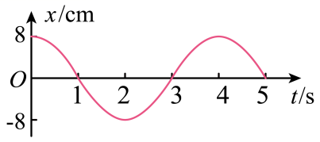

## 讲解

### 判据

位移—时间图像的纵坐标给相对平衡位置的带符号位移，切线斜率给速度。图线向上倾斜表示正向运动，向下倾斜表示负向运动；斜率绝对值越大，速率越大。

简谐运动的加速度还可由位移判断：

$$a=-\omega^2x=-\left(\frac{2\pi}{T}\right)^2x.$$

因此位移与加速度反向，加速度大小与离开平衡位置的距离成正比。图像的峰、谷不是波在空间中的形状，而是同一个振子随时间的记录。

### 流程

1. **先读坐标单位和周期。** 纵轴若为cm，求动力学数值前换成m。相邻同类峰的时间差是T，峰到紧邻谷是T/2。
2. **读位置。** 看纵坐标正负判断原点哪侧；要比较距离用 $|x|$，要比较带符号位移直接比较x，不混说“增大”。
3. **读速度。** 看切线的倾斜方向与陡缓，不能用纵坐标判断速度。峰谷处斜率零、速度零；过零点斜率绝对值最大、速率最大。
4. **读加速度。** 由位移反向判断a方向，再由 $|a|=\omega^2|x|$ 判断大小。加速度向正，不代表速度也向正。
5. **判断加速或减速。** 比较v与a方向：同向速率增大，反向速率减小。对一段过程，要沿图像看这两个方向是否中途改变。
6. **判断动量与动能。** 同质量下动量方向随v，动能随速率平方。同一位置斜率可正可负，动量不一定相同；对称位置的速率可相同、动能相同。

## 例题

> 题目与解析：高二上物理第二章  机械振动·基础通关卷（解析版）.docx，来源ID S13，第21—32段。分段选取时保留该子问的完整题干、答案与解析；题目背景和原资料标注照录。

3．如图所示，为某弹簧振子在0~5s内的振动图象。由图可知，下列说法中正确的是（　　）

A．第2s内振子在做加速度增大的加速运动

B．在t=0.5s和t=1.5s这两个时刻，振子的动量等大反向

C．t=2s时振子的速度为零，加速度为正向的最大值

D．第3s内振子的位移增大，动能减小

**原资料答案：** C

**原资料详解：** 

A．该图像的斜率表示速度，由图可知第2s内速度是减小的，故A错误；

B．该图像的斜率表示速度，可知在t=0.5s和t=1.5s这两个时刻，振子的速度相同，故这两个时刻振子的动量相同，故B错误；

C．该图像的斜率表示速度，可知在t=2s时图像的斜率为零，所以速度为零，位移最大，合力最大，且指向正方向，所以加速度为正向最大，故C正确；

D．第3s内位移减小，动能增大，故D错误。

故选C。

### 顺着本题再看清一步

**原解析用语校正：** 图中 $T=4\,\mathrm{s}$、$A=8\,\mathrm{cm}$。第2s振子在负侧继续远离原点，$v<0$、$a>0$，所以减速而加速度大小增大，A错。0.5s和1.5s的斜率都为负且大小相同，动量同向相同，B错。2s为负端点，速度零、正向加速度最大，C对。第3s的x由−8cm增至0，速率增大、动能增大，故D的“动能减小”错。

## 易错

- 本题第2s是1～2s，第3s是2～3s，不能把“第2s”当作2～3s。
- 原解析A说“速度减小”，准确意思是速率减小；负速度从负最大值趋向零，带符号速度反而增大。
- 原解析D说“位移减小”，准确意思是位移绝对值减小；第3s的x由负值升至零，带符号位移增大。答案仍为C。
