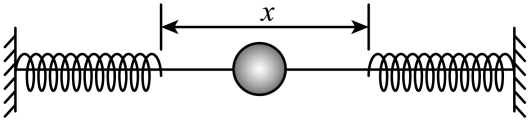

## 讲解

### 判据

“来回运动”“周期性运动”只能确定有振动，不能确定简谐。明确平衡位置以后，整个研究范围内的振动方向回复力与相对平衡位置的位移成正比且反向，才满足动力学判据：

$$F_{\text{回}}=-kx,\quad k>0\text{且恒定}.$$

若题目给时间规律，也可检查位移是否为振幅、频率固定的正弦或余弦函数。速度、加速度大小会改变，简谐运动一般不是匀变速运动。

### 流程

1. **确定模型与平衡位置。** 选系统、选振动方向，把该方向的合力为零的位置记作原点。竖直弹簧的原点是静止伸长后的平衡位置，不能选弹簧原长位置。
2. **写真实受力。** 水平弹簧可能由一个弹簧力回复；竖直弹簧要把重力与弹簧力相加；单摆要取切向分量。不要另加一个叫“回复力”的新力。
3. **把力写成位移函数。** 例如竖直弹簧先有 $mg=k\Delta l_0$，偏移后有 $F=mg-k(\Delta l_0+x)$，代入平衡条件才得到 $-kx$。
4. **检查整个往返范围。** 中途有没有脱离、碰撞、无力区、弹性系数改变或明显阻力？只在某一小段有 $-kx$，不能证明完整往返都是简谐运动。
5. **与时间规律对照。** 若图像峰高衰减或峰间距变化，就不满足固定振幅、固定频率的理想简谐模型；若只讨论小角度、短时间等近似，写出近似条件。

判据中的 $x$ 单位m、$k$ 单位N/m、$F$ 单位N。线性关系中的负号有方向含义，不是简单“力大小为负”。

## 例题

> 题目与解析：第二章 机械振动（专项训练）（解析版）.docx，来源ID S02，第112—122段。分段选取时保留该子问的完整题干、答案与解析；题目背景和原资料标注照录。

8．（25-26高二下·甘肃兰州·期末）如图所示，一根固定在墙上的水平光滑杆，两端分别固定着相同的轻弹簧，两弹簧自由端相距x。套在杆上的小球从中点以初速度v向右运动，小球将做周期为T的往复运动，则（     ）

A．小球做简谐运动

B．小球动能的变化周期为T

C．两根弹簧的总弹性势能的变化周期为$\frac{T}{2}$

D．小球的初速度为$\frac{v}{2}$时，其运动周期为2T

**原资料答案：** C

**原资料详解：** 

A．物体做简谐运动的条件是它在运动中所受回复力与位移成正比，且方向总是指向平衡位置，可知小球在杆中点到接触弹簧过程，所受合力为零，此过程做匀速直线运动，故小球不是做简谐运动，故A错误；

BC．假设杆中点为$O$，小球向右压缩弹簧至最大压缩量时的位置为$A$，小球向左压缩弹簧至最大压缩量时的位置为$B$，可知小球做周期为$T$的往复运动过程为$O\to A\to O\to B\to O$；根据对称性可知小球从$O\to A\to O$与$O\to B\to O$，这两个过程的动能变化完全一致，两根弹簧的总弹性势能的变化完全一致，故小球动能的变化周期为$\frac{T}{2}$，两根弹簧的总弹性势能的变化周期为$\frac{T}{2}$，故B错误，C正确；

D．小球的初速度为$\frac{v}{2}$时，可知小球在匀速阶段的时间变为原来的$2$倍，接触弹簧过程，根据弹簧振子周期公式$T_0=2\pi\sqrt{\frac{m}{k}}$，可知接触弹簧过程所用时间与速度无关，即接触弹簧过程时间保持不变，故小球的初速度为$\frac{v}{2}$时，其运动周期应小于$2T$，故D错误。

故选C。

### 顺着本题再看清一步

将中央间距记作题干的 $x$，避免与判据的位移混淆。小球一个完整往返穿过中央区四次半程，总自由运动距离 $2x$，用时 $2x/v$；两次“压缩到最深再返回”各占理想弹簧周期 $T_0/2$，合计 $T_0$，所以 $T=2x/v+T_0$。初速度减半后 $T_{\rm new}=4x/v+T_0<2T$。这条推导来自原题的运动分段，不是把非简谐往返硬套单一弹簧周期。

## 易错

- 本题中央自由区内小球虽偏离中点，合力仍为零，已经否定全程F=-kx，A错误。
- 两侧对称使动能和弹性势能每半周期重复，不代表位置与速度状态也每半周期重复；B错误、C正确。
- 初速度减半只会使自由区用时加倍，弹簧接触段的时间不加倍，D错误。
