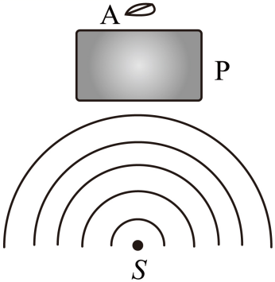

## 讲解

### 判据

缝、孔或障碍物的特征尺寸a与波长λ相差不多，或者更小时，容易观察到明显衍射。比较的是a/λ，不是单独比较a大小。

遇到固定障碍物、给定波速近似不变的题，可由λ=v/f判断：降低频率，波长增大，相对障碍物更长，绕入阴影区更明显。

### 流程

1. **找正在挡波的几何对象。** 以缝宽、孔径或障碍物尺寸作a，不用源到障碍物距离冒充尺寸。
2. **求或比较λ。** 图像用相邻同类波面间距；已知v、f用λ=v/f。所有长度先统一单位。
3. **比较a/λ。** 同一障碍物下，λ越大，明显程度一般越高；同λ下缩小障碍物或开口的相对尺寸，绕射更明显。
4. **对应选项的改变。** 改频率可能改λ；改振幅主要改振动强弱，不能直接改变几何尺寸与波长的比；移动源也不直接改变这个比值。
5. **保留观察条件。** 题目把阴影区叶片“不动”作理想近似，所需是足够明显的绕射传到那里，不能由观察不出就宣称波完全不存在。

实际水波可能色散；本题按教材给的波速近似不变模型判断降频增波长，不把它变成任意水域的定量测量规则。

## 例题

> 题目与解析：第三章 机械波（专项训练）（解析版）.docx，来源ID S02，第384—390段。分段选取时保留该子问的完整题干、答案与解析；题目背景和原资料标注照录。

26．（25-26高二下·甘肃定西·期末）如图为俯视图，P为桥墩，A为靠近桥墩浮出水面的叶片，波源$S$连续振动，形成水波，此时叶片A静止不动．为使水波能带动叶片振动，能实现的方法是（　　 ）

A．提高波源$S$频率

B．降低波源$S$频率

C．减小波源$S$到桥墩的距离

D．波源$S$振幅减小

**原资料答案：** B

**原资料详解：** 为使水波能带动叶片振动，则必须要使得水波发生明显的衍射现象，即增大波长，减小水波频率，降低波源$S$频率；而减小波源$S$到桥墩的距离，减小波源$S$振幅都不能使水波产生明显的衍射现象。

故选B。

### 顺着本题再看清一步

看到叶片位于桥墩后方，先想到传播的阴影区，再想到衍射。原题未给桥墩尺寸或实际水深，因此只作定性比较，不补造阈值、频率数值或水深条件。

## 易错

- 降低频率使波长增大、绕过桥墩更明显，B正确。
- A提高频率在给定模型下缩短波长，方向相反。
- C改变源距离、D减小振幅，都没有改善障碍物尺寸/波长这个判据；D还会减弱振动响应。
