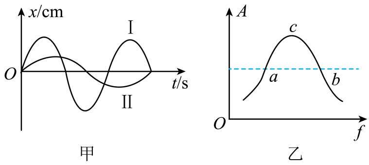

## 讲解

### 判据

自由振动图像的周期给固有频率；驱动稳定后的位移图像给受迫频率，也就是驱动频率；振幅—驱动频率曲线的峰给共振位置。这三种读法对应三个不同问题。

高中弱阻尼口径为：

$$f_{\text{受迫}}=f_{\text{驱}},\qquad \text{共振时 }f_{\text{驱}}\approx f_0.$$

稳定受迫振动总跟随驱动节奏，但只有驱动接近固有频率时响应振幅大。频率单位Hz、周期单位s、振幅单位m；不要因振幅相同就认为频率也相同。

### 流程

1. **分别读两条时间图的周期。** 用同类峰到同类峰的间距，不比较峰高。对本题I是自由振动、II是稳定受迫振动，必须保留题干给的身份。
2. **周期转频率。** $f=1/T$，所以周期较长的曲线频率较低。由 $T_{\rm II}>T_{\rm I}$ 得驱动频率小于固有频率。
3. **把频率关系带到共振曲线。** 横轴从左到右频率增加，峰左侧小于共振频率，峰右侧大于共振频率。较低频率对应左支，不能仅按振幅高度选左右支。
4. **判断怎样靠近峰。** 在左支提高驱动频率，在右支降低驱动频率；是否最终共振还须驱动可调范围允许达到峰。
5. **辨别谁改变。** 改外界转速只改变驱动频率；改摆长、质量、回复力系数可改变固有频率，进而移动共振峰。

“刚开始驱动”和“稳定后”不同。初始自由振动未衰减时不能机械套单一受迫频率；共振峰的精确位置也受阻尼影响，本条按原题高中弱阻尼图示处理。

## 例题

> 题目与解析：第二章 机械振动（专项训练）（解析版）.docx，来源ID S02，第368—377段。分段选取时保留该子问的完整题干、答案与解析；题目背景和原资料标注照录。

28．（多选）（25-26高二上·湖北·期末）某做简谐运动的弹簧振子，自由振动时的振动图像如图甲中的曲线I所示，而在某驱动力作用下做受迫振动时，稳定后的振动图像如图甲中的曲线II所示，乙图为受迫振动的振幅A与驱动力的频率f的关系图像，关于此受迫振动对应的状态下列说法正确的是（　　）

A．可能是图乙中的$a$点

B．可能是图乙中的$b$点

C．减小驱动力的频率，弹簧振子可能发生共振

D．增大驱动力的频率，弹簧振子可能发生共振

**原资料答案：** AD

**原资料详解：** AB．根据图甲可知II的周期大于I，即弹簧振子在驱动力的作用下的运动频率小于原振动频率，所以可能是图乙中的a点，而不是b，故A正确，B错误；

CD．当驱动力的频率等于弹簧振子的固有频率时会发生共振现象，所以应增大驱动力的频率，故C错误，D正确。

故选AD。

### 顺着本题再看清一步

原题A、B先用时间图确定频率，再用共振曲线定位。只有a在峰左支，符合驱动频率小于固有频率，A正确、B错误。C、D再比较调节方向；此时提高而非降低频率才可能到共振，故选AD。

## 易错

- 图甲曲线II峰间距较大，所以周期更大、频率更小，不能凭它振幅小就猜频率小。
- 图乙a、b振幅相同但频率不同；甲图给出的频率关系选择a。
- 提高驱动频率向峰靠近，D正确；降低会继续远离，C错误。
