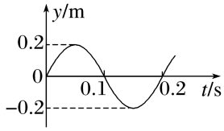

## 讲解

### 判据

横轴时间t的图像追踪同一个质点，给周期；横轴位置x的图像冻结同一时刻，给波长。两图纵轴都可用位移，不能只凭曲线形状辨别。

| 信息 | 振动图y-t | 波形图y-x |
|---|---|---|
| 固定量 | 某个质点的平衡位置 | 某一时刻 |
| 横轴重复间距 | 周期T，单位s | 波长λ，单位m |
| 斜率 | 质点速度 | 空间形状的陡缓 |
| 传播速度 | 还需要距离信息 | 还需要时间信息 |

### 流程

1. **先看横轴和单位。** 写明图中纵位移是m还是cm、横轴是s还是m，避免把振幅和波长相混。
2. **从时间图读初始状态与周期。** 本题源在零时刻从平衡位置向上，第一次波谷在3T/4、第二次波谷再加一个T。
3. **把时间条件换成传播延迟。** 后面P刚起振时，源已振动了7T/4；这一时间就是波从O传到P的时间，不能用P自己的振动时间去代。
4. **算波速和波长。** 用v=距离/到达时间，再由λ=vT；不要把质点累计路程放进传播速度的分子。
5. **沿传播方向比较相位。** Q比P更晚受到扰动，延迟是PQ/v。已起振的P在这段时间继续振动，按同一周期判断它的位置。

若同时有两张图，需要确认时间图对应哪个点、波形图是哪一时刻；只有身份与时刻对上，才可把速度方向与空间斜率结合反推传播方向。

## 例题

> 题目与解析：第三章 机械波（知识清单）（教师版）.docx，来源ID S06，第191—204段。分段选取时保留该子问的完整题干、答案与解析；题目背景和原资料标注照录。

3.（2024·新课标卷）位于坐标原点O的波源在t＝0时开始振动，振动图像如图所示，所形成的简谐横波沿x轴正方向传播。平衡位置在x＝3.5 m处的质点P开始振动时，波源恰好第2次处于波谷位置，则 （      ）

A.波的周期是0.1 s

B.波的振幅是0.2 m

C.波的传播速度是10 m/s

D.平衡位置在x＝4.5 m处的质点Q开始振动时，质点P处于波峰位置

**原资料答案：** BC

**原资料解析：** 波的周期和振幅与波源相同，由振动图像可知波的周期为T＝0.2 s，振幅为A＝0.2 m，故A错误，B正确；

P开始振动时，波源恰好第2次到达波谷，故可知此时经过的时间为t＝$\frac{3}{4}$T＋T＝0.35 s

故可得波速为v＝$\frac{{x}_{OP}}{t}$＝$\frac{3.5}{0.35}$m/s＝10m/s

故C正确；

波长λ＝vT＝2 m

$x_{PQ}$＝4.5 m－3.5 m＝$\frac{λ}{2}$

故可知当质点Q开始振动时，质点P处于平衡位置，故D错误。

### 顺着本题再看清一步

该原题只给源的振动图，没有另附波形图，正适合检查能否把时间信息转换为空间传播。P在到达前尚未振动；Q刚起振时，P重复的是源半周期之后的状态。题目原标注“2024·新课标卷”照录，未另作外部真题认证。

## 易错

- 图是源的y-t，T=0.2s、A=0.2m，A项的0.1s只是半周期，B正确。
- 第二次到波谷的时间0.35s，对应O→P的3.5m传播，v=10m/s，C正确。
- PQ=1m=λ/2，Q起振时P已振动半周期、位于平衡位置，不是波峰，D错误。
