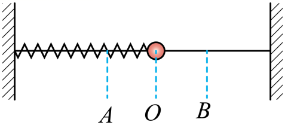

## 讲解

### 判据

理想水平弹簧振子中，相对平衡位置的位移决定回复力大小与弹性势能；速度决定动能。离平衡位置越远，回复力、加速度大小越大，弹性势能越大，速率和动能越小。

从弹簧力 $F=-kx$ 与牛顿第二定律得 $a=-kx/m$。从弹性势能与机械能守恒得：

$$E_p=\frac12kx^2,\qquad E=E_k+E_p=\frac12kA^2.$$

在本模型中 $x$ 单位m、$k$ 单位N/m、能量单位J。两式说明力和加速度看 $|x|$，势能看 $x^2$；不是都看带符号坐标的数值大小。

### 流程

1. **确认系统。** 理想水平振子取球与弹簧的机械能；只取球，弹簧力对它做功，球的动能会变化，不能说球自身机械能不变。
2. **找各位置离平衡位置的距离。** 对称两点x异号但绝对值相同，回复力反向等大、动能相同、势能相同。
3. **用总能量反推速度。** 把端点 $v=0,x=A$ 代入总能量，再减去当前位置弹性势能：

$$\frac12mv^2=\frac12k(A^2-x^2),\qquad |v|=\sqrt{\frac{k}{m}(A^2-x^2)}.$$

4. **判断过程中的转化。** 向平衡位置运动，回复力与运动同向，做正功，势能减、动能增；离开平衡位置，力做负功，势能增、动能减。
5. **检查模型边界。** 竖直弹簧的总势能包括重力势能与弹性势能；单摆比较重力势能，回复力是切向分量。阻尼使总机械能减少，不能继续按同一个E比较多轮振动。

端点速度为零不是加速度为零；平衡位置加速度为零不是速度为零。动能与势能的变化周期通常为T/2，位置与速度状态的周期为T。

## 例题

> 题目与解析：第二章 机械振动（专项训练）（解析版）.docx，来源ID S02，第46—57段。分段选取时保留该子问的完整题干、答案与解析；题目背景和原资料标注照录。

3．（24-25高二下·河南信阳·阶段检测）如图所示，把一个小球套在光滑细杆上，球与轻弹簧相连组成弹簧振子，弹簧中心轴线与细杆平行，弹簧与细杆间无接触，小球沿杆在水平方向做简谐运动，小球在A、B间振动，O为平衡位置，如图所示，下列说法正确的是（　　）

A．小球振动的振幅等于A、B间的距离

B．小球在A、B位置时，动能和加速度都为零

C．小球从B到O的过程中，弹簧振子振动的机械能保持不变

D．小球从O到B的过程中，回复力做负功，弹簧弹性势能减小

**原资料答案：** C

**原资料详解：** 

A．小球振动的振幅等于A、O间的距离，故A错误；

B．在A、B位置时，速度为零，动能最小，位移最大，回复力最大，加速度最大，故B错误；

C．振子的动能和弹簧的势能相互转化，且总量保持不变，即弹簧振子振动的机械能保持不变，故C正确；

D．小球从O到B的过程中，回复力做负功，弹簧弹性势能增加，故D错误。

故选C。

### 顺着本题再看清一步

先用位置判力，再用功判动能与势能，能避免单独背“最大、最小”。本题B→O时力与运动同向，弹簧做正功；O→B时反向，弹簧做负功。两段总能量都不变，但动能和弹性势能各自变化。

## 易错

- A把两端间距2A当振幅。
- B的动能确为零，但加速度大小最大，因此整个选项错。
- C讨论球与弹簧组成的理想振子，机械能守恒。
- D离开平衡位置，回复力做负功，动能转为弹性势能，势能增加而非减小。
