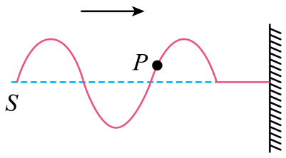

## 讲解

### 判据

已知横波传播方向和某时刻波形，在固定质点的横坐标处比较“现在高度”与“稍后高度”，就能判断上下振动方向。向前移动的是波形状态，质点横坐标仍代表同一个平衡位置。

右行波形在短时间内向右平移，固定点的新高度来自左邻近位置；左行时来自右邻近位置。因此在波形斜率不为零处，右行波的质点速度与空间斜率异号，左行波同号。

### 流程

1. **确认坐标是y-x。** 若横轴为t，那是振动图，直接看时间斜率，不能再用波形平移法。
2. **找传播箭头。** 右行时取固定点左边紧邻的高度，左行时取右边紧邻高度；比较该高度与当前高度，新高度较高即向上、较低即向下。
3. **把理由缩成上下坡法。** 沿波传播方向看，上坡处向下，下坡处向上。必须沿传播方向，不是永远从左向右看。
4. **端点单独处理。** 波峰、波谷此刻速度为零，严格说没有此刻向上或向下速度；随后分别向下、向上返回。不能把“下一刻运动方向”写成端点当时非零速度。
5. **必要时反推传播方向。** 若某点的上下速度已知，比较两种微平移结果，选择与已知方向一致的传播方向。

位移方向由y正负确定，加速度方向由 $a=-\omega^2y$ 确定，速度方向需时间变化信息；三者在同一点并不一定一致。

## 例题

> 题目与解析：高二上物理第三章  机械波·基础通关卷（解析版）.docx，来源ID S13，第16—21段。分段选取时保留该子问的完整题干、答案与解析；题目背景和原资料标注照录。

2．质点S沿竖直方向做简谐运动，某时刻在绳上形成的波形如图所示，P为绳上一质点。此时质点P的运动方向（    ）

A．向下

B．向上

C．向右

D．向左

**原资料答案：** A

**原资料详解：** 质点在波的传播过程中，只在各自的平衡位置附近上下振动，不随波迁移。图中波向右传播，根据“上坡下，下坡上”的口诀，质点$P$位于“上坡”路段，因此$P$点向下振动。故A正确，B、C、D错误。

故选A。

### 顺着本题再看清一步

不用口诀也可判断：用手指固定P横坐标，让整条波形略向右移动，P处的新高度比旧高度低。C、D的错误不是波传播朝哪边，而是把横波质点的振动方向写成水平传播方向。

## 易错

- P在波形上坡段，波向右，固定P下一刻由左边较低的高度替代，所以向下，A正确。
- B向上与微平移结果相反。C、D是传播方向轴上的运动，绳上质点不随波沿左右迁移。
- 口诀省略了非端点条件，波峰/谷此刻速度零须另说。
