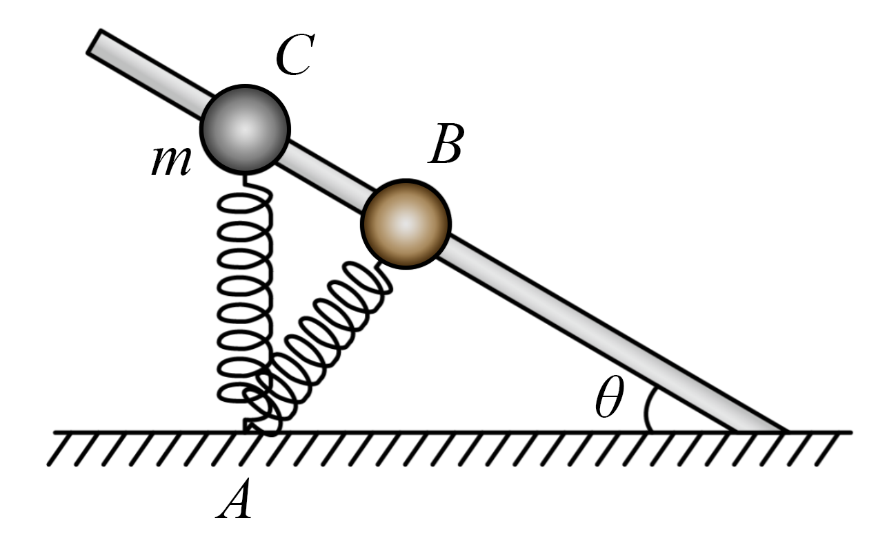

## 错法

“物体除了重力还受支持力或绳力，所以机械能不守恒。”错误在用受力数量替代做功和系统边界的判断。

另一个错误是“有弹力做功，所以机械能一定守恒”，却只计算小球动能与重力势能，漏掉弹簧的势能。

## 正解

先选研究系统，再判断有哪些能量项和外界功。固定光滑轨道或导杆的支持力垂直运动，虽有力但不做功；固定悬点的理想绳拉力也可垂直小球瞬时位移。

含理想弹簧的完整系统，动能、重力势能、弹性势能可以互相转化。只取小球，其机械能可因弹簧的外界功而改变；把弹簧加入系统并计入势能后，总机械能才可能守恒。

$$\Delta(E_k+E_G)_{\mathrm{小球}}=W_{\mathrm{弹}}\quad\text{（其他非重力功为零时）}$$

支持物在运动、绳端被人拉动时，支持力或拉力可能做功，不能再沿用固定约束的零功结论。“光滑”只去掉接触摩擦，不自动去掉所有外界能量输入。

## 例题

> 题目与解析：第八章 机械能守恒定律（知识清单）（答案版）.docx，来源ID S06，第335—345段。题目背景与原资料标注照录。

【例5】如图所示，固定的倾斜光滑杆上套有一个质量为m的小球，小球与一轻质弹簧一端相连，弹簧的另一端固定在地面上的A点，已知杆与水平面之间的夹角θ<45°，当小球位于B点时，弹簧与杆垂直，此时弹簧处于原长。现让小球自C点由静止释放，在小球滑到杆底端的整个过程中，关于小球的动能、重力势能和弹簧的弹性势能，下列说法正确的是（　　）

A．小球的动能在B点达到最大

B．小球的重力势能与弹簧的弹性势能之和保持不变

C．小球的动能与弹簧的弹性势能之和减小

D．小球的动能与重力势能之和先增大后减少

**原资料答案：** D

**原资料详解：** 

B．小球和弹簧组成的系统的机械能守恒，而小球的动能可能先增大后减小，也可能一直增大，所以小球的重力势能与弹簧的弹性势能之和可能先减小后增大，或者一直减小，故B错误；

A．当小球的合外力为零时，小球的动能最大，而在B点时弹簧处于原长状态，弹力为零，小球受重力和支持力，两力的合力不为零，故此时小球动能不是最大，故A错误；

C．小球和弹簧组成的系统的机械能守恒，而小球的重力势能一直减小，所以小球的动能与弹簧的弹性势能之和增大，故C错误；

D．小球自C点由静止释放到B的过程中，弹簧的弹力做正功，所以小球的机械能增大，从B点向下，弹簧的弹力与速度方向成钝角，弹簧的弹力做负功，小球的机械能减小，故小球的动能与重力势能之和先增大后减少，故D正确。

### 顺着本题再看清一步

原题答案D。球与弹簧系统守恒，球自身机械能在弹簧对球先正功、后负功的过程中先增后减。A把原长当动能最大，B漏了变化的动能，C把重力势能减少后的其余能量变化弄反，均错；D正确说的是单球部分，不与整体守恒矛盾。
