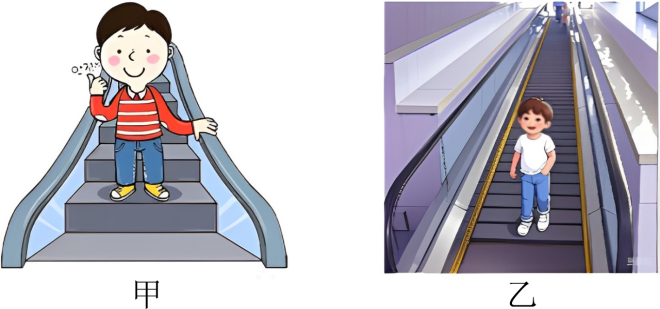

## 讲解

### 是什么

功描述力在位移过程中向物体传递能量的作用。恒力作用在按质点模型处理的物体上时，功等于力与位移的点积：

$$W=Fs\cos\alpha$$

F是恒力大小，单位N；s是该过程位移大小，单位m；α是力与位移夹角；W单位J，1 J＝1 N·m。功是标量，正负表示能量传递方向，不表示一个空间箭头。

### 怎么来的

把恒力分解成沿位移的分量Fcosα和垂直位移的分量。沿位移分量参与改变沿运动方向的能量，垂直分量不因这段位移做功，所以得到上式。

夹角锐角时为正功，钝角时为负功，垂直时为零。判断的是力与物体相对于选定参考系的位移，不是物体与施力物体之间有没有相对滑动。

变力或曲线运动可分成很短小段，分别按当段的力和位移算功，再作代数和。不能把不断变化的力直接乘总位移；大小恒定、始终反向于运动的阻力，则可把每小段负功加成负的阻力乘总路程。

### 什么时候能用

支持力不一定不做功，静摩擦不一定不做功。移动的台阶带人下降，支持力竖直向上而人的位移斜向下，支持力做负功；在固定光滑轨道上，支持力与瞬时运动方向垂直，才不做功。

同一物体受多个力时，总功等于各力功的代数和，也等于合力的功。不要把正功大小相加后遗漏负功。

本条默认地面惯性系近似及质点模型。若讨论可变形物体、转动或内部能量，力的作用点运动也要明确，不能无条件把任何力都乘整体重心位移。

## 例题

> 题目与解析：高一下物理第八章  单元测试·基础卷（解析版）.docx，来源ID S10，第6—15段。题目背景与原资料标注照录。

1．如图所示，图甲是一人站在台阶式自动扶梯上匀速向下运动（不计扶手的影响），图一是一人站在履带式自动扶梯上匀速向下运动，且两人相对扶梯均静止。下列关于力做功的说法正确的是（　　）

A．甲图中摩擦力对人做正功

B．甲图中支持力对人做负功

C．乙图中摩擦力对人做正功

D．乙图中支持力对人做负功

**原资料答案：** B

**原资料详解：** AB．对图甲中受力分析，受重力和支持力两个力，支持力与速度v的夹角为钝角，做负功，故A错误，B正确；

CD．对图乙中受力分析，受重力、支持力与静摩擦力，支持力与速度v的夹角为90°，不做功，$F_f$与速度方向相反，做负功，故CD错误。

故选B。

### 顺着本题再看清一步

原题选B。甲的水平踏面上人受重力与竖直支持力，匀速运动时二者平衡，但下降过程中重力正功、支持力负功，总功为零。乙的斜履带上还需静摩擦平衡重力沿坡分量，静摩擦方向与运动相反，负功；支持力垂直轨迹，零功。所以A、C、D错误，B正确。

## 易错

原题甲中摩擦力为零，不能凭人站在扶梯上就说摩擦做正功；乙中支持力垂直于沿履带的位移，不做功，静摩擦沿坡向上而位移向下，做负功。
