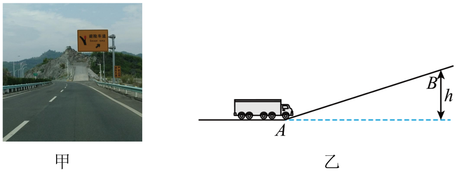

## 讲解

### 是什么

动能是物体由于运动而具有的能量。固定质量质点在经典力学中的动能为：

$$E_k=\frac12mv^2$$

m单位kg，v是相对于所选参考系的速率，单位m/s，E_k单位J。速率非负，质量为正，动能不为负；速度方向相反不会使动能变负。

### 怎么来的

从恒合力作用下的直线运动出发，牛顿第二定律给F合＝ma，运动学给v₂²−v₁²＝2as。先将第二式除以2，得到as＝(v₂²−v₁²)/2，再乘质量：

$$F_{\mathrm{合}}s=mas=\frac12mv_2^2-\frac12mv_1^2$$

右边表明半个质量乘速度平方的变化，正好对应合力做功，因此定义这个量为动能。系数1/2由运动学关系得到，不能遗漏。

### 什么时候能用

比较同质量物体，速率翻倍，动能为四倍；比较同速率物体，动能与质量成正比。动能本身与动能变化不同：停止时末动能为零，但动能变化是负的初动能。

参考系不同，速度数值可以不同，动能也不同。同一计算中必须选同一参考系，不能初速用车内、末速用地面。

本式用于经典质点模型。明显的转动物体还可能有转动动能，不能把所有能量都写成重心的mv²/2；接近光速时也不能把此式当成通用精确关系。

动量大小p＝mv，平方得p²＝m²v²；动能E_k＝mv²/2，两式联立得

$$E_k=\frac{p^2}{2m},\qquad |p|=\sqrt{2mE_k}$$

同一质量下反向但等速率可有相同动能、不同动量；同动量大小不同质量时动能与质量成反比。p²是矢量大小的平方，不是把两个不同方向的动量随意平方相加。

## 例题

> 题目与解析：第一章 动量守恒定律（知识清单）（教师版）.docx，来源ID S06，第235—248段。分段选取时保留该子问的完整题干、答案与解析；题目背景和原资料标注照录。

2.羽毛球是速度较快的球类运动之一，运动员扣杀羽毛球的速度可达到100 m/s，假设球飞来的速度为50 m/s，运动员将球以100 m/s的速度反向击回．设羽毛球的质量为10 g，试求：

(1)运动员击球过程中羽毛球的动量变化量；

(2)运动员击球过程中羽毛球的动能变化量．

**原资料答案：** (1)1.5 kg·m/s，方向与羽毛球飞来的方向相反  (2)37.5 J

**原资料解析：** (1)以羽毛球飞来的方向为正方向，则

$p_1=mv_1=10\times10^{-3}\times50\,\mathrm{kg\cdot m/s}=0.5\,\mathrm{kg\cdot m/s}$

$p_2=mv_2=-10\times10^{-3}\times100\,\mathrm{kg\cdot m/s}=-1\,\mathrm{kg\cdot m/s}$

所以动量的变化量

$\Delta p=p_2-p_1=-1\,\mathrm{kg\cdot m/s}-0.5\,\mathrm{kg\cdot m/s}$

$=-1.5\,\mathrm{kg\cdot m/s}$

即羽毛球的动量变化量的大小为1.5 kg·m/s，方向与羽毛球飞来的方向相反．

(2)羽毛球的初动能$E_k=\frac12mv_1^2=12.5\,\mathrm J$

末动能$E_k^{\prime}=\frac12mv_2^2=50\,\mathrm J$

所以动能变化量$\Delta E_k=E_k^{\prime}-E_k=37.5\,\mathrm J$

### 顺着本题再看清一步

以飞来方向为正，质量10 g＝0.010 kg，初速度+50 m/s、末速度−100 m/s。动量分别+0.5、−1 kg·m/s，所以

$$\Delta p=(-1)-0.5=-1.5\,\mathrm{kg\cdot m/s}$$

负号说明变化指向击回方向，变化量大小1.5，不是两个动量大小作差得0.5。动能则先分别平方：初12.5 J、末50 J，末减初37.5 J。反向速度仍给正动能，所以两问不能采用同一“减速率大小”运算。

### 上一章已核验的完整原题

> 题目与解析：高一下物理第八章  单元测试·基础卷（解析版）.docx，来源ID E08S10（必修第二册第八章），第32—41段。题目背景与原资料标注照录。

3．避险车道是指在长下坡路段行车道外侧增设的供刹车失灵的车辆驶离正线安全减速的专用车道，如图甲是某高速公路旁建设的避险车道，简化为图乙所示。若质量为m的货车刹车失灵后以速度$v_0$经A点冲上避险车道，运动到B点速度减为0，货车所受摩擦阻力恒定，不计空气阻力。已知A、B两点高度差为h，重力加速度为g，下列关于该货车从A运动到B的过程说法正确的是（　　）

A．合外力做的功为$\frac12mv_0^2$

B．重力做的功为mgh

C．摩擦阻力做的功为$\frac12mv_0^2-mgh$

D．摩擦阻力做的功为$mgh-\frac12mv_0^2$

**原资料答案：** D

**原资料详解：** 

A．货车从A运动到B的过程，根据动能定理可知合外力做的功为$W_{\mathrm{合}}=0-\frac12mv_0^2=-\frac12mv_0^2$，故A错误；

B．重力做的功为$W_G=-mgh$，故B错误；

CD．根据动能定理可得$-mgh+W_f=0-\frac12mv_0^2$

可得摩擦阻力做的功为$W_f=mgh-\frac12mv_0^2$，故C错误，D正确。

故选D。

#### 对上一章原题的说明

货车初动能mv₀²/2，末动能零，所以ΔE_k＝−mv₀²/2。重力功为−mgh，支持力零功，摩擦功W_f需满足−mgh+W_f＝−mv₀²/2，得W_f＝mgh−mv₀²/2，对应D。A的总功符号错，B重力功符号错，C未正确计入重力功，原题选D。

## 易错

动能含速率平方，反向不使它负；动量变化不保证动能改变；能量变化仍末减初，停止时为负初动能。
