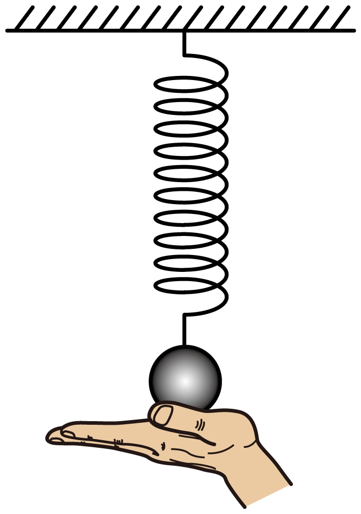

## 讲解

### 是什么

弹性势能是物体因弹性形变而具有的势能。理想轻弹簧在弹性限度内满足胡克定律，劲度系数k单位N/m；以原长作为形变量零点，形变量x单位m，取原长时弹性势能为零。

$$E_{\mathrm{弹}}=\frac12kx^2$$

伸长和压缩都可储存弹性势能，x可带正负，但势能取平方。该式针对胡克弹簧，不是任意材料、任意大形变的普遍公式。

### 怎么来的

弹力随形变量从0线性增大到kx，不能把末端弹力kx当成全程恒力。缓慢把弹簧从原长变形到x，外力克服弹力所做功对应力—形变量图中三角形面积：底x、高kx，面积为kx²/2。

将这部分可恢复的做功存成势能，便得到上式。弹簧回到原长时，势能可转回动能或其他能量；弹力功与弹性势能变化满足W弹＝−ΔE弹。

### 什么时候能用

判断变化先比较形变量绝对值，不能只看物体在上升还是下降。竖直弹簧从压缩到原长再伸长，形变大小先减小到零再增大，弹性势能随之先减小后增大。

原长与竖直弹簧悬挂物体的平衡位置一般不同：平衡时弹力等于重力，弹簧通常已经伸长。速度最大的位置也可能在平衡位置，不等于弹性势能最小的位置。

判断机械能守恒时，要把弹簧纳入研究系统并计入它的势能。只取小球的动能加重力势能，弹簧对小球做功时，这一部分机械能可以变化。塑性形变、内耗等不属于本条理想弹簧模型。

## 例题

> 题目与解析：第八章 机械能守恒定律（复习讲义）（解析版）.docx，来源ID S04，第217—223段。题目背景与原资料标注照录。

【变式5-2】如图所示，上端固定的轻弹簧下端连接一个小球，用手托起小球，使弹簧处于压缩状态，在$t=0$时刻释放小球，小球向下运动第一次到最低点的时刻为$t_1$，关于弹簧的弹性势能变化说法正确的是（　　）

A．一直增大

B．一直减小

C．先减小再增大

D．先增大再减小

**原资料答案：** C

**原资料详解：** 由题意可知，释放小球时，弹簧处于压缩状态，小球运动到最低点时，弹簧处于伸长状态，所以弹簧先从压缩状态到原长，再变为伸长状态，弹簧的弹性势能先减小再增大。

故选C。

### 顺着本题再看清一步

释放时压缩，先下降使压缩量减小，势能减少；经过原长时形变为零，势能最小；再下降使弹簧伸长，势能增加。所以C正确，A、B的单调变化和D的相反顺序均错。原题没有给劲度系数和形变量数值，本条只作变化判断，不编造数值结果。

## 易错

原题A、B只看小球一直下降，漏看弹簧经过原长；D把变化顺序反了。弹性势能最小在原长处，不在最低点，也不必在重力与弹力平衡的位置。
