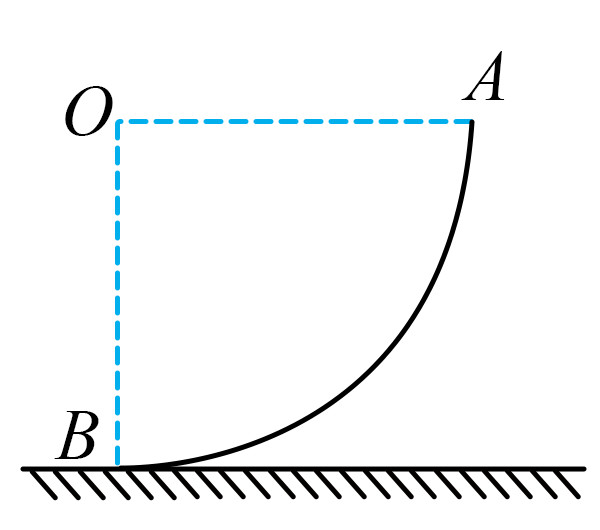

## 讲解

### 判据

“这段时间内平均做功快慢”用总功除总时间；“经过某点时”“某一时刻”用该时刻力与速度的点积。题问重力功率，速度取沿重力的竖直分量，不直接取合速率。

两端瞬时功率相同，不能推出平均功率与它们相同；途中做功仍可能积累为非零总功。

### 流程

1. **圈定题问的力与时间范围。** 本题是重力，不是支持力，也不是所有力的总功率。平均量范围是A到B全过程，瞬时量只看A或B。
2. **求瞬时方向关系。** A处从静止释放，速度为零，功率零；B处速度水平，与重力垂直，所以功率也零。
3. **求过程总功。** A到B重心下降圆弧半径R，重力功mgR为正；与路径弧长不同，不使用mg乘四分之一圆周路程。
4. **再算平均功率。** P平均＝mgR/t，t是整个过程实际时间，不用某点速度乘全程力来代替。
5. **判断途中趋势。** P_G＝mgv_y，竖直分速度由零变为正值，再在最低点回到零；光滑固定圆弧模型中功率先增加后减小。合速率持续增大并不保证重力功率一直增大。
6. **需要数值时再找时间或分速度。** 资料没给这些量就保留符号，不能因两个端点零功率而编一个平均值零。

若恒力矢量已知，平均功率也可由力与过程平均速度的点积求得；但曲线运动中平均速度须用净位移除时间，不是平均速率。

## 例题

> 题目与解析：第八章 机械能守恒定律（知识清单）（答案版）.docx，来源ID S06，第187—197段。题目背景与原资料标注照录。

【例2】高邮市珠湖小镇的超级滑梯可简化成光滑的四分之一圆弧轨道，游客从最高点A（与圆心O等高）由静止滑下，则游客（　　）

A．在B点时重力势能一定为零

B．在A、B两点时重力的瞬时功率相等

C．从A点运动到B点的过程中，重力的平均功率为零

D．从A点运动到B点的过程中，重力的瞬时功率先减小后增大

**原资料答案：** B

**原资料详解：** 

A．零势能面的位置未知，小球滑到B点时重力势能不一定为0，故A错误；

BD．小球在A点时，速度为0，则根据$P=mgv_y$可知，重力的瞬时功率为0，小球在B点时，速度方向与重力方向垂直，所以重力瞬时功率为零，则小球从A点运动到B点的过程中，重力的瞬时功率先增大后减小，故B正确，D错误；

C．从A点运动到B点的过程中，重力的平均功率为$\bar P=\frac{mgR}{t}$，不为0，故C错误；

故选B。

### 顺着本题再看清一步

A错，零面未定；B对，两端均为0；C错，W_G＝mgR>0，平均功率为mgR/t>0；D错，重力功率随竖直分速度先增大后减小。原题选B。支持力全程垂直运动、零功，而重力全程正功，二者也不能混为一谈。

## 易错

B两端瞬时功率相等而正确；C将它们与平均功率混同；D把先增后减写成先减后增。没有给零势能面，A也不能成立。
