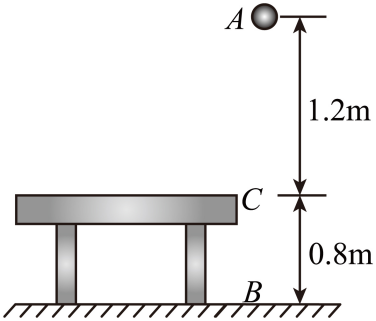

## 讲解

### 判据

只要近地面重力mg可视为恒定，重力功由初末高度差决定；势能变化由末高度减初高度决定；势能数值另须零平面。先把这三种问法分清，符号就有依据。

先下后上、曲线或反弹不改变重力功只看起终点的特点；它们可能改变其他力的功，不能一起忽略。

### 流程

1. **明确初末状态。** A到C的过程虽然经过地面B，起点仍是A、终点仍是C，不把最低位置当最终高度。
2. **统一高度基准。** 可临时以地面为高度零，A高2.0 m、B高0、C高0.8 m；若题求势能数值则按题指定的桌面零势能面重算有符号高度。
3. **重力功用初减末。** W_G＝mg(h初−h末)，下降总差1.2 m为正功；B到C上升0.8 m为负功。
4. **势能变化用末减初。** ΔE_p＝mg(h末−h初)＝−W_G。势能“减少量”是下降时的正值大小，不要与变化量混用。
5. **势能数值看零面。** 以桌面为零，B的h＝−0.8 m，所以E_pB＝−8 J；零平面不能中途改为地面。
6. **检查是否把路径长度当高度差。** 下落再反弹的路程更长，重力功仍只等于mg乘净高度下降。改变路径不改变这段重力功，但碰撞过程可能损失机械能。

如果物体不是质点，要用重心的初末高度。若g随高度明显变化，则本章mgh形式需要换成相应重力模型。

## 例题

> 题目与解析：高一下物理第八章  单元测试·基础卷（解析版）.docx，来源ID S10，第16—31段。题目背景与原资料标注照录。

2．如图所示，质量为1kg的小球（视为质点）从距桌面高度为1.2m处的A点下落到水平地面上的$B$点，与地面碰撞后恰好能上升到与桌面等高的$C$点，$C$点距地面的高度为0.8m。取重力加速度大小$g=10\,\mathrm{m/s^2}$。下列说法错误的是（　　）

A．在小球从A点经$B$点运动到$C$点的过程中，重力对小球做的功为12J

B．在小球从$B$点运动到$C$点的过程中，重力对小球做的功为-8J

C．以桌面为重力势能的参考平面，小球在A点时的重力势能为12J

D．以桌面为重力势能的参考平面，小球在$B$点时的重力势能为零

**原资料答案：** D

**原资料详解：** 

A．在小球从A点经B点运动到C点的过程中，重力对小球做的功为$W_{AC}=mgh_{AC}=1\times10\times1.2\,\mathrm J=12\,\mathrm J$

故A正确，不符合题意；

B．在小球从$B$点运动到$C$点的过程中，重力对小球做的功为$W_{BC}=-mgh_{BC}=-1\times10\times0.8\,\mathrm J=-8\,\mathrm J$

故B正确，不符合题意；

C．以桌面为重力势能的参考平面，小球在A点时的重力势能为$E_{pA}=mgh_{AC}=1\times10\times1.2\,\mathrm J=12\,\mathrm J$

故C正确，不符合题意；

D．以桌面为重力势能的参考平面，小球在$B$点时的重力势能为$E_{pB}=-mgh_{BC}=-1\times10\times0.8\,\mathrm J=-8\,\mathrm J$

故D错误，符合题意。

本题选错误的，故选D。

### 顺着本题再看清一步

A：1×10×(2.0−0.8)＝12 J，正确；B：1×10×(0−0.8)＝−8 J，正确；C：桌面以上1.2 m，势能12 J，正确；D：桌面以下0.8 m，势能−8 J，错误。题问错误项，选D。

## 易错

原题D在地面处机械地填0，却忘了零面为桌面。A、B说的是不同过程的功，不矛盾；功与势能变化符号相反。
