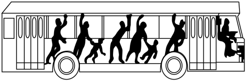

## 错法

“车速度越快，越难停，所以速度越大惯性越大。”错误在把停止过程的难度直接当作惯性大小的量度，没有控制其他条件。

同一质量物体，即使在同一制动力下，较大的初速度也需要更长时间才能减为零；这可以由相同加速度作用更长时间来解释，不需要让质量或惯性跟着速度改变。

## 正解

在本章固定质量的经典模型中，惯性大小只由质量量度。质量相同，受同样合力时加速度相同；不同初速度仍可对应不同停止时间和距离。

$$a=\frac{F_{\mathrm{合}}}{m},\qquad\Delta v=a\Delta t$$

第二个关系限于恒加速度阶段。较大的速度变化量，在相同加速度下需要更长时间，解释了为什么快车更难在短时间停住；它不表示快车具有更大的惯性。

静止时同样有惯性，合力为零不消除惯性，失重也不消除惯性。分析急刹车时，人的各部分受到的约束力先后不同，才产生相对车厢的前倾。

## 例题

> 题目与解析：第四章 运动和力的关系（复习讲义）（解析版）.docx，来源ID S04，第75—84段。题目背景与原资料标注照录。

【变式1-1】公交车在平直公路行驶时，如偶遇突发状况司机急刹车，乘客的身体会出现前倾的情况，故而在搭乘时注意抓好扶手，安全乘车，则以下说法中正确的是（　　）

A．公交车急刹车时，乘客所受合力向后

B．公交车速度越快，乘客惯性越大

C．公交车静止时，乘客没有惯性

D．当乘客拉着扶手合力为0时，乘客此时没有惯性

**原资料答案：** A

**原资料详解：** 

A．司机急刹车时，乘客出现身体前倾，摩擦力与乘客相对运动趋势方向相反，则摩擦力即合力方向向后，故A正确；

BCD．惯性大小的唯一量度就是质量，质量大的惯性大，与物体的形状，运动状态等其它因素无关，任何物体都有惯性，故BCD错误。

故选A。

### 顺着本题再看清一步

A正确：急刹车时乘客整体需要向后的合力以减小向前速度。B错误：速度增大不改变质量。C错误：静止物体也保持原状态。D错误：合力为零意味着运动状态保持，并不是没有惯性。故选A。
