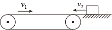

## 讲解

### 判据

先比较物块与带面的速度，而不是只看物块对地运动方向。滑动摩擦阻碍相对滑动：带面向右、物块向左时，摩擦向右；物块向右且比带快时，摩擦向左。

速度相等只是一个可能的分界。物块可能在共速之前就离开有限长度的带，也可能在共速后受其他力而再次滑动。倾斜传送带还要检查维持共速所需静摩擦是否超过最大值。

### 流程

1. **定轴并写相对速度。** 向右为正，比较v物−v带；相对速度的正负决定滑动摩擦朝左还是朝右。题中物块从右端向左进入，不能把其初速度直接当正数使用。
2. **列滑动阶段受力。** 水平、仅重力支持力和摩擦时N＝mg，滑动加速度大小μg。带速大小改变，并不一定改变这段摩擦力大小。
3. **先检查是否停得下来。** 反向进入时，停下所需距离v₀²/(2μg)须与实际带长比较。若超过带长，物块先从左端离开，没有之后向右的阶段。
4. **若能停下，重新确定剩余路程。** 物块停在距右端一定距离处，随后在右向摩擦下加速。回到右端可走的距离，等于它此前向左走的距离，不是整条带长。
5. **比较共速所需距离。** 从静止加速到带速需v带²/(2μg)。它小于返回距离才有共速后的阶段；否则物块加速尚未完成就离开右端。
6. **共速后再查受力。** 本例水平且没有额外水平力时，可随带匀速；若有斜面重力分量或额外推拉力，必须求需要的静摩擦，不能自动写摩擦为零。

每段末速度、位置作为下一段初始条件。把“停止”“共速”“离开带面”作为三个竞争事件，先比较哪个先发生，再写真实经历的阶段。

## 例题

> 题目与解析：第四章 运动和力的关系（知识清单）（答案版）.docx，来源ID S06，第517—524段。题目背景与原资料标注照录。

3．如图所示，绷紧的长为6m的水平传送带，沿顺时针方向以恒定速率$v_{1}$＝2m/s运行。一小物块从与传送带等高的光滑水平台面滑上传送带，其速度大小为$v_{2}$＝5m/s。若小物块与传送带间的动摩擦因数μ＝0.2，重力加速度g＝10m/$\mathrm{s}^{2}$，下列说法中正确的是（　　）

A．小物块在传送带上先向左做匀减速直线运动，然后向右做匀加速直线运动

B．若传送带的速度为5m/s，小物块将从传送带左端滑出

C．若小物块的速度为4m/s，小物块将以2m/s的速度从传送带右端滑出

D．若小物块的速度为1m/s，小物块将以2m/s的速度从传送带右端滑出

**原资料解析：** 

A．小物块在传送带上先向左做匀减速直线运动，设加速度大小为a，速度减至零时通过的位移大小为x，根据牛顿第二定律得$\mu mg=ma$，解得$a=\mu g=2\,\mathrm{m/s^2}$，则

$x=\frac{v_2^2}{2a}=6.25\,\mathrm m>6\,\mathrm m$，所以小物块将从传送带左端滑出，不会向右做匀加速直线运动，A错误；

B．若传送带的速度为5m/s，小物块在传送带上受力情况不变，则运动情况也不变，仍会从传送带左端滑出，B正确；

C．若小物块的速度为4m/s，小物块向左减速运动的位移大小为$x^\prime=\frac{{v_2^\prime}^2}{2a}=4\,\mathrm m<6\,\mathrm m$，则小物块的速度减到零后再向右加速，小物块加速到与传送带共速时的位移大小为$x^{\prime\prime}=\frac{v_1^2}{2a}=1\,\mathrm m<4\,\mathrm m$，以后小物块以$v_{1}$＝2m/s的速度匀速运动到右端，则小物块从传送带右端滑出时的速度为2m/s，C正确；

D．若小物块的速度为1m/s，小物块向左减速运动的位移大小为$x^{\prime\prime\prime}=\frac{{v_2^{\prime\prime}}^2}{2a}=0.5\,\mathrm m<6\,\mathrm m$，则小物块速度减到零后再向右加速，由于$x^{\prime\prime\prime}<x^{\prime\prime}$ ，则小物块不可能与传送带共速，小物块将以1m/s的速度从传送带的右端滑出，D错误。故选BC。

### 顺着本题再看清一步

**答案：BC。** 加速度大小a＝μg＝2 m/s²。

A：以5 m/s向左进入，停下需25/4＝6.25 m，比带长6 m还大，先离开左端，故错。B：带速改为5 m/s后，进入时仍相对带面向左滑，摩擦方向、大小相同，仍先离开左端，故对。

C：以4 m/s进入，向左停下走16/4＝4 m；回右端有4 m可用，从静止达到2 m/s只需4/4＝1 m，剩余3 m随带匀速，出口速度2 m/s，故对。

D：以1 m/s进入，先向左走

$$d=\frac{1^2}{2\times2}=0.25\,\mathrm m$$

回右端也只有0.25 m，未达到共速所需的1 m。用返回段运动关系求出口速度：

$$v_{\mathrm{出}}^2=0+2\times2\times0.25=1,\quad v_{\mathrm{出}}=1\,\mathrm{m/s}$$

故D错。不能见“带速2 m/s”就把它当作物块的必然出口速度。

## 易错

原题A忽略停止距离大于带长，D忽略返回右端前能否共速。原解析D把1²/(2×2)算成0.5 m，这是数值笔误，正确为0.25 m；“不能共速、以1 m/s离开”的结论仍正确。
