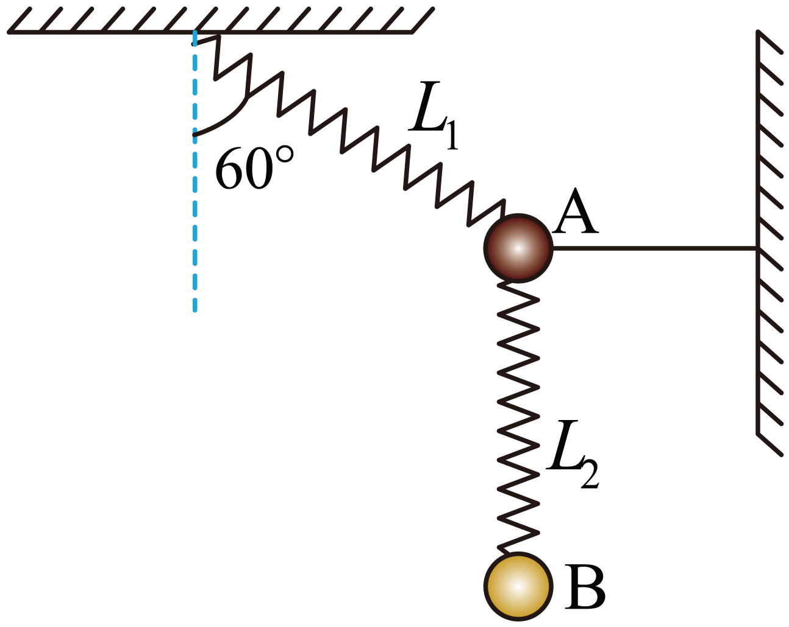

## 讲解

### 判据

题目出现“剪断”“撤去”“松开”的瞬间，关键是哪些约束立即取消，哪些量来不及发生有限变化。要比较事件前后的受力，不能沿用事件前的平衡式当作事件后的结论。

理想轻绳剪断后不能继续传递原来的拉力；普通弹簧的弹力由当时形变量决定，剪断别的绳的极短瞬间，弹簧长度没有发生有限改变，弹力保留剪断前的数值。这里采用高中集中参数模型，忽略弹性波传播过程。

### 流程

1. **先算事件前的力。** 初始平衡给出竖直和水平分量关系。多物体可先选整体消去内部弹簧力，再单独选某个物体得到另一根弹簧的力。
2. **用材料条件建立联系。** 两根相同弹簧有相同劲度系数，形变量比3∶1才对应弹力比3∶1。若不是相同弹簧，不能直接把位移比当力比。
3. **逐个标记事件后的力。** 被剪绳的拉力消失；两根未改变长度的弹簧弹力保持原瞬时值；重力不变。不要因为系统以后会重新运动，就在剪断瞬间先换一个新的弹簧伸长量。
4. **求新合力。** 原来平衡时合力为零，撤去某个力后，其他力的合力正好与被撤力等大反向。这个快捷关系来自初始平衡，若原来就在加速则不能照搬。
5. **分别除以各自质量。** 上球少了绳力，出现加速度；下球的重力和弹簧力此刻都没变，可以仍然瞬时合力为零。但随后弹簧长度改变，它也可能开始加速。

要区分“瞬间仍平衡”和“此后一直平衡”。瞬时速度连续不代表加速度连续，瞬时弹簧力保留也不代表全程恒定。

## 例题

> 题目与解析：第四章 运动和力的关系（知识清单）（答案版）.docx，来源ID S06，第272—278段。题目背景与原资料标注照录。

【例2】如图所示，轻弹簧$L_{1}$的一端固定，另一端连着小球A，小球A的下面用另一根相同的轻弹簧$L_{2}$连着小球B，一根轻质细绳一端连接小球A，另一端固定在墙上，平衡时细绳水平，弹簧$L_{1}$与竖直方向的夹角为60°，弹簧$L_{1}$的形变量为弹簧$L_{2}$形变量的3倍，重力加速度大小为g。将细绳剪断的瞬间，下列说法正确的是（　　）

A．小球A的加速度大小为$3\sqrt3g$

B．小球A的加速度大小为$\frac{3\sqrt3}2g$

C．小球B的加速度大小为$\frac13g$

D．小球B的加速度大小为$g$

**原资料解析：** AB．对A、B和弹簧$L_{2}$整体受力分析，可得弹簧$L_{1}$的弹$F_1=\frac{(m_A+m_B)g}{\cos60^\circ}=2(m_A+m_B)g$

绳上的拉力为$T=F_1\sin60^\circ=\sqrt3(m_A+m_B)g$，单独对B受力分析有弹簧$L_{2}$的弹力大小为$F_2=m_Bg$，根据题干信息$F_1=3F_2$，可得$m_B=2m_A$，切断绳后，两个弹簧的弹力不变，A球合力与绳拉力等大反向，所以$a_A=\frac T{m_A}=3\sqrt3g$，故A正确，B错误；CD．对小球B，受力分析不变，加速度依然为0，故CD错误。故选A。

### 顺着本题再看清一步

**答案：A。** 整体竖直平衡给出F₁cos60°＝(m_A+m_B)g；下球平衡给出F₂＝m_Bg。相同弹簧及形变量比给出F₁＝3F₂，于是

$$2(m_A+m_B)g=3m_Bg,\quad2m_A+2m_B=3m_B,\quad m_B=2m_A$$

剪断前绳力抵消上弹簧的水平分量：

$$T=F_1\sin60^\circ=\sqrt3(m_A+m_B)g=3\sqrt3m_Ag$$

剪断瞬间上球的新合力水平向左，大小T，所以a_A＝T/m_A＝3√3g，A正确、B错误；下球受力未变，a_B＝0，C、D均错误。后来两根弹簧的长度会改变，此时的零加速度不保证下球永远静止。

## 易错

原题B少算质量比例导致上球加速度错误；C、D没有看到下球在此刻受力不变。弹簧弹力不能简单写成“与绳一样都突变为零”；绳的约束和弹簧形变量是两种不同机制。
