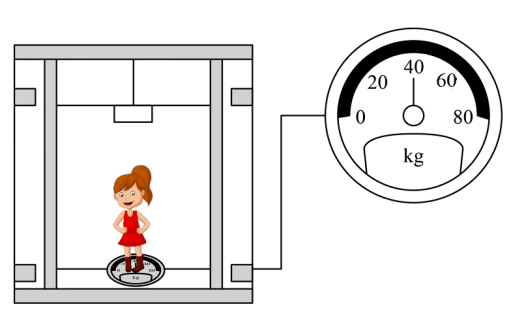

## 讲解

### 判据

最直接的判据是压力或拉力与重力相比，而不是上升还是下降。题给秤读数时先转为支持力；题给运动过程时先找竖直加速度，再用受力式。

只有重力和竖直支持力或拉力的基本模型中，向上加速度对应超重，向下加速度对应失重。若有别的竖直力，必须列全力后再判断接触力。

### 流程

1. **确定真实质量和重力。** 静止时用秤的质量读数确定m，重力为mg。运动中读数变化不说明m或g改变。
2. **辨认读数测什么。** 刻度为N直接是压力大小；刻度为kg是压力除以校准g后的换算值。把换算值乘g，得到可用于受力式的N。
3. **选正方向写方程。** 向上为正时N−mg＝ma_y；向下为正时mg−N＝ma。符号来自所选轴，不能一边取向下正一边仍把N写成正向力。
4. **比较并解释。** N比mg小，说明称重接触力减少；本模型中加速度向下。原因是重力超过支持力，剩余合力使速度向下改变。
5. **把速度与加速度分开。** 加速度向下可以是向下加速，也可以是向上减速。若题目没有初速度或相应图像，只能确定加速度，不能确定电梯此时上行、下行。
6. **检查接触。** 完全失重时N＝0。若二力模型算出N小于零，而地板只能向上推，应判定人可能离开地板，重新划分阶段。

“超重”是称重作用的变化，不是物体多出一部分真实质量，也不是重力与支持力这一对力大小相等的要求。

## 例题

> 题目与解析：第四章 运动和力的关系（复习讲义）（解析版）.docx，来源ID S04，第317—326段。题目背景与原资料标注照录。

【变式6-1】在升降电梯内地板上放一体重计，某同学站在体重计上，电梯静止时体重计示数为$50\,\mathrm{kg}$；电梯运动过程中，某一段时间内该同学发现体重计示数为$40\,\mathrm{kg}$，$g=10\,\mathrm{m/s^2}$，则在这段时间内（　　）

A．该同学所受重力变小了

B．电梯的加速度大小为$\frac g5$，方向一定竖直向下

C．电梯一定在竖直向下运动

D．该同学对体重计的压力小于体重计对她的支持力

**原资料答案：** B

**原资料详解：** ABC．电梯静止时体重计示数为$50\,\mathrm{kg}$；电梯运动过程中，某一段时间内该同学发现体重计示数为$40\,\mathrm{kg}$，在这段时间内该同学所受重力保持不变，根据牛顿第二定律可得$mg-N=ma$

解得加速度大小为$a=\frac{mg-N}{m}=\frac{50\times10-40\times10}{50}=2\,\mathrm{m/s^2}=\frac g5$

加速度方向竖直向下；但电梯可能向上运动，也可能向下运动，故AC错误，B正确；

D．该同学对体重计的压力与体重计对她的支持力是一对相互作用力，大小总是相等，故D错误。

故选B。

### 顺着本题再看清一步

A：重力仍为500 N，错。B：压力400 N，合力向下100 N，a＝100/50＝2 m/s²＝g/5，对。C：向上减速也有同样的示数，错。D：压力与支持力是相互作用力，不因电梯加速而不等大，错。故选B。

## 易错

原题压力与支持力作用在不同对象上，是第三定律力对，始终等大；人的重力与支持力作用在人身上，可以不等大，差额产生加速度。失重不能推出向下运动。
