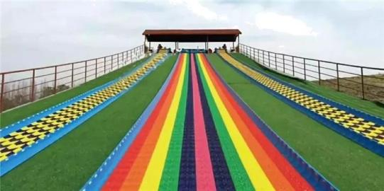

## 讲解

### 判据

已知力、质量求运动，或已知位移、时间、速度反求力和摩擦因数，连接两端的共同量是加速度。看到题中既有“受力”又有“运动时间、距离”，先找哪一侧能先确定加速度。

模型须满足选定参考系可用牛顿定律；用匀变速公式还要确认该阶段合力恒定。斜面接水平面、外力撤去、滑动转静止，通常就是新阶段的开始。

### 流程

1. **先分段并定对象。** 同一个人和滑垫可视为整体；斜坡和水平面分开分析，因为重力沿运动方向的分量变了。题设说过交界时速率不变，才把前段末速作为后段初速。
2. **从信息最全的一侧求加速度。** 斜坡由静止、距离和时间已知，可以先用位移公式求a；此时不用猜摩擦力大小。
3. **画真实外力并选坐标。** 斜面沿下滑方向为正，重力分量沿下坡，摩擦沿上坡；法向无加速度时支持力等于重力的法向分量。分解重力只是求分量，不能再把整重力重复加入。
4. **用合力等于ma反求未知。** 摩擦大小等于动摩擦因数乘支持力，把前一步的a代入，得到摩擦因数。每个式子对应同一对象、同一阶段。
5. **再把受力结果带回运动。** 水平面上法向支持力变为mg，摩擦形成减速加速度；前段末速度已知，求停下所需距离。减速用有符号加速度，或明确a₂表示减速度大小，两种写法不能混用。
6. **核验边界。** 水平段算到速度为零就停，不把滑动摩擦继续推成反向运动；检查所用距离是否在实际场地范围内，单位是否相容。

这类题的路线可以是“运动信息→加速度→力”，也可以是“力→加速度→运动”，由已知条件决定，不必固定先算受力。

## 例题

> 题目与解析：高一上物理第四章  单元测试·基础卷（解析版）.docx，来源ID S10，第190—206段。题目背景与原资料标注照录。

13．（8分）如图，永春牛姆林的七彩滑道曾是福建省内最长的旱雪滑道。其倾斜部分可近似为倾角$24^\circ$长$80\,\mathrm m$的斜面。一游客坐在滑垫上，从斜面顶端由静止开始沿直线匀加速下滑，经$20\,\mathrm s$时间滑到斜面底端，然后滑到水平滑道上，做匀减速直线运动直至停下。游客从斜面底端滑到水平滑道速率不变，滑垫与滑道间的动摩擦因数处处相同，取$\sin24^\circ=0.4,\quad\cos24^\circ=0.9$，重力加速度$g=10\,\mathrm{m/s^2}$。求：

（1）滑垫与滑道间的动摩擦因数；

（2）游客在水平滑道上滑行的距离。

**原资料答案：** （1）$\mu=0.4$；（2）$s_2=8\,\mathrm m$

**原资料详解：** （1）设游客在斜面上滑行的加速度大小为$a_1$，根据运动学公式、牛顿第二定律得

$s_1=\frac12a_1t_1^2$①

$mg\sin24^\circ-\mu mg\cos24^\circ=ma_1$②

由①②得

$\mu=0.4$③

（2）游客到达斜面底端时速度大小为v，则

$v=a_1t_1$④

设游客在水平面上滑行的加速度大小为$a_2$，根据运动学公式、牛顿第二定律得

$\mu mg=ma_2$⑤

$v^2=2a_2s_2$⑥

由③④⑤⑥得

$s_2=8\,\mathrm m$⑦

### 顺着本题再看清一步

题中把sin24°和cos24°分别近似为0.4、0.9，计算沿用给定值。

斜坡从静止出发，用距离80 m、时间20 s：

$$80=\frac12a_1\times20^2,\qquad a_1=0.4\,\mathrm{m/s^2}$$

再把a₁代入沿斜坡的受力式，先约去共同质量，再求μ：

$$10\times0.4-\mu\times10\times0.9=0.4,\quad9\mu=3.6,\quad\mu=0.4$$

斜坡末速由v＝a₁t得到8 m/s。水平面减速度大小由摩擦决定，a₂＝μg＝4 m/s²。用停止时末速为零：

$$0-8^2=2(-4)s_2,\qquad s_2=8\,\mathrm m$$

这不是两个互不相干的公式计算：前段先确定材料的摩擦因数和交界速度，后段才有足够信息确定停止距离。

## 易错

原解析用a₂表示减速度的大小，所以写v²＝2a₂s₂；若取前进为正，实际加速度是−a₂，应用0−v²＝2(−a₂)s₂。斜坡摩擦不是μmg，而是μmgcos24°；水平阶段才为μmg。
