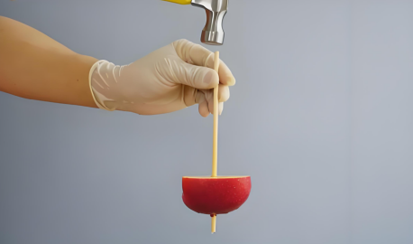

## 讲解

### 判据

题目出现“突然启动、急刹车、敲击后相对位置改变、车内跳起、失重后是否仍有惯性”，通常要把惯性与外力改变运动的作用分开。

判断的入口是：原来相对于哪个参考系怎样运动？突然受到力的是谁？题目说的“向前”“向上”，究竟相对于地面还是相对于已经改变运动的载体？

不要看到相对位置改变，就先给物体补一股沿该方向的力。物体与载体速度不同，也能产生相对运动。

### 流程

1. **先记原运动状态。** 敲击前苹果和筷子近似静止；匀速车内的人已有车的水平速度。初始状态决定随后在短时间内保留的是什么。
2. **找先发生改变的对象。** 锤子直接使筷子迅速向下改变运动；车刹车时车身先减速。把力作用在哪个对象上说清，不能把筷子的力直接当成苹果的合力。
3. **说明其他物体为何来不及同样改变。** 接触力可能使苹果也运动，但短时内它的位移远小于筷子的位移。所谓保持位置，在实验说明中是这种短时近似，并非真的没有任何外力。
4. **转回题目指定的参考系。** 筷子向下移得多，苹果向下移得少，于是苹果相对于筷子“向上爬”；这不等于苹果相对于地面加速向上。
5. **最后检查惯性大小。** 比较的是质量，不是速度、合力、是否失重。实际实验是否更容易成功，还受到摩擦、尺寸和操作等因素影响，只讨论题目保持其他条件近似相同的情况。

一个完整解释要包含“原状态→外力作用对象→速度或位移改变的差别→相对运动”。只写“因为惯性”不能说明为什么偏偏是这个方向。

## 例题

> 题目与解析：高一上物理第四章  单元测试·提升卷（解析版）.docx，来源ID S14，第6—14段。题目背景与原资料标注照录。

1．如图所示，物理老师用一根筷子穿透一个苹果，他一手拿筷子，另一只手拿锤子敲击筷子上端，发现苹果会沿着筷子向上“爬”，下列说法正确的是（　　）

A．苹果越小越容易完成该实验

B．苹果受到筷子的向上的力才会向上“爬”

C．该实验原理主要是利用牛顿第一定律

D．该实验原理主要是利用牛顿第三定律

**原资料答案：** C

**原资料详解：** 该实验的原理是牛顿第一定律，即惯性定律，任何物体总要保持原有的运动状态（静止或匀速直线运动），除非外力迫使它改变这种状态。当拿锤子敲击筷子上端时，筷子快速下降，而苹果由于具有惯性，要保持原有的运动状态，位置保持不变，但筷子下降，则苹果相对筷子在向上运动，即苹果会沿着筷子向上“爬”，不是苹果受到筷子的向上的力向上“爬”，苹果越大，质量越大，惯性越大，越容易完成该实验。

故选C。

### 顺着本题再看清一步

A：质量较小并不会仅凭惯性因素更容易保持原状态，原资料据此判错；实际效果还取决于接触条件。B：向上爬是相对于下移的筷子，不能推出苹果受向上合力。C：利用物体保持原状态的性质，正确。D：第三定律能说明相互作用力，却不能单独给出这个相对位移解释。故选C。

## 易错

原题B从“向上爬”反推向上的力，忽略相对运动；D只抓锤子与筷子相互作用，没有解释苹果为何相对筷子移动。原解析“苹果位置保持不变”按敲击短时近似理解；A关于大小的判断也以其他条件相近为前提。
