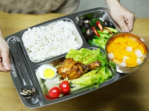

## 讲解

### 是什么

几个力作用在同一点，或它们的作用线相交于同一点，称为共点力。作用线是沿力的方向通过作用点的直线，不是只看画出的短箭头有没有交叉。共点条件让我们能在同一作用点按矢量规则合成这些力。

质点模型中，物体尺寸被忽略，各力画在同一点，适合按共点力处理。对有尺寸的物体，即便各接触位置不同，若作用线会交，也可能是共点力；若作用线分离，则需考虑物体转动，不能只凭合力零判断完整平衡。

### 怎么来的

物体受多个力时，先保留每个真实作用的来源。若把受力物体看成质点，可将各箭头起点画在同一个代表点，以合成矢量表示对其运动的共同效果，这就建立了共点力的处理方式。

共点不表示大小相同，也不表示方向相同。同一点上的重力、支持力和摩擦力可有不同方向；它们的矢量和决定共同作用效果。任意两个力合成后，可再与第三个合成；合成顺序不改变最终合力，但不能把真实力与合力一起重复加。

原例苹果在餐盘上，研究整体平动时采用质点/共点力模型。餐盘对苹果的作用可能包含法向支持和切向摩擦，它们的合力才是“盘对苹果的总作用力”，不要把这个总作用与两分力同时画作三个额外力。

### 什么时候能用

先说明研究对象以及质点或共点条件。共点力静止或匀速直线运动时可令合力零；若有非零加速度，即便力共点也不能令和为零。对真实扩展物体，合力为零只保证平动加速度零，转动是否平衡还要另查；本章公式不替代所有转动条件。

## 例题

> 题目与解析：高一上物理第三章  单元测试·基础卷（解析版）.docx，来源ID S10，第45—56段。题目背景与原资料标注照录。

5．某餐厅工作人员给顾客送餐情景如图所示。假设餐盘保持水平，盘中的物品四周都留有一定的空间，并与餐盘保持相对静止，则下列说法正确的是（    ）

A．匀速向前行走时，盘对苹果的作用力水平向前

B．减速向前行走时，苹果受到4个力的作用

C．苹果对餐盘的压力和餐盘对苹果的支持力是一对平衡力

D．若餐盘稍微倾斜，但盘和苹果仍静止，则苹果受盘的作用力方向竖直向上

**原资料答案：** D

**原资料详解：** 

A．匀速向前行走时，水果处于平衡状态，则盘对水果的作用力竖直向上，故A错误；

B．减速行走时，水果受到重力、水果盘对水果的支持力和摩擦力，共3个力的作用，故B错误；

C．苹果对餐盘的压力和餐盘对苹果的支持力是一对相互作用力，故C错误；

D．若餐盘稍微倾斜，但盘和水果仍静止，则水果受盘的作用力与重力等大反向，即竖直向上，故D正确。

故选D。

### 顺着本题再看清一步

**答案：D。** A匀速前行时苹果平衡，盘的总作用向上抵消重力，没有向前的净水平作用。B减速时受重力、支持力、摩擦力三股，不是四股；水平摩擦负责减速。C压力与支持力分别作用盘和苹果，是相互作用而非平衡。D倾盘后仍静止，盘对苹果的支持加摩擦之合力必须竖直向上。

## 易错

- “合力竖直向上”不等于支持力必定竖直；餐盘倾斜时，支持力沿法线，摩擦沿盘面，两者合成才可能竖直。
- 减速前行时苹果有水平加速度，不能套平衡合力零。
- 相互作用力分属两个对象，不能作为同一苹果的两个共点外力相消。
