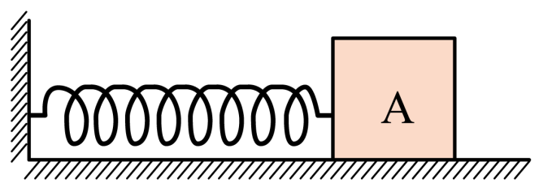

## 讲解

### 是什么

力是一个物体对另一个物体的作用。说清一个力，需要指出谁施力、谁受力，以及大小、方向、作用点这三个要素；力的单位是牛顿，符号N。力可以改变物体的运动状态，也可以使物体发生形变，这两类效果都能帮助我们辨认力。

力是矢量：同样大小，向左推与向右推效果不同；同样方向和大小，作用位置改变也可能改变转动效果。因此画受力图时，箭头不能只有名字而没有方向，更不能把施力物体忘掉。

### 怎么来的

力这一概念从物体相互作用的效果中建立。接触面挤压产生弹力，粗糙接触面相对滑动或有相对滑动趋势时可产生摩擦力；重力则不要求与地球表面接触。每个力都有作用来源，“物体往右运动”本身不是一个施力物体，也不能据此另添一个向右的“运动力”。

力的示意图只表达作用点、方向及类别；力的图示进一步选统一标度，用有向线段长度表达大小。例如同图每1 cm代表若干N，才能比较箭头的力值。不同图不同比例尺的箭头长度不能直接比较。

对于本条原题，研究物块A，地球、地面、弹簧分别提供作用；地面还能沿接触面提供静摩擦。数清力靠接触与相互作用来源，不靠看到几个运动方向。

### 什么时候能用

受力分析先选对象，只画别人对这个对象的力。整体研究时，内部相互作用不画作整体外力；隔离某个物体时，相邻物体对它的力就需画出。受力不等于合力非零：静止物体仍能受多个力，恰好相互平衡。合力与分力为等效表示，不能把二者同时当作额外真实力重复加进同一受力图。

## 例题

> 题目与解析：第三章 相互作用--力（知识清单）（答案版）.docx，来源ID S04，第327—333段。题目背景与原资料标注照录。

【针对训练1】如图所示，粗糙水平面上，轻质弹簧的一端与质量为m = 4 kg的物体A相连，另一端与竖直墙壁相连，已知弹簧原长L = 20 cm、弹簧的劲度系数k = 600 N/m，A与地面间的动摩擦因数μ = 0.4，g取10 m/$\mathrm{s}^{2}$，如图，使弹簧处于压缩状态，弹簧长度为18 cm，A处于静止状态，最大静摩擦力等于滑动摩擦力，以下说法正确的是（　　）

A．物块A受到4个力作用

B．弹簧对物块施加的弹力大小为12 N，方向水平向左

C．物块受到摩擦力大小为16 N，方向水平向左

D．物体受到摩擦力大小为12 N，方向水平向左

**原资料解析：** BCD．根据胡克定律可知弹簧弹力大小为$F_{\text{弹}}=k\Delta x=600\times(20-18)\times10^{-2}\,\mathrm N=12\,\mathrm N$，方向水平向右，物块与地面间的最大静摩擦力$f_{\max}=F_{\text{滑}}=\mu mg=0.4\times4\times10\,\mathrm N=16\,\mathrm N$，此时弹簧弹力小于最大静摩擦力，则物块受到静摩擦力的作用$f=F_{\text{弹}}=12\,\mathrm N$，方向与弹力方向相反，水平向左，故BC错误，D正确；

A．对物块受力分析，可知物块A受到重力，支持力，弹簧弹力以及静摩擦力4个力的作用，故A正确。故选AD。

### 顺着本题再看清一步

**答案：AD。** A数力正确，分别来自地球、地面法向接触、地面切向接触和弹簧。B弹力大小12 N算对，方向却错，压缩弹簧推物块向右。C把最大静摩擦16 N当实际摩擦，错误；实际需抵消12 N向右弹力，所以D的12 N向左成立。

## 易错

- A静止不表示“没受力”，而表示各力的矢量和为零。
- 弹簧力向右、静摩擦向左都是物块受到的力；物块对弹簧的反作用不能画到物块图上。
- 四个力的名称要带来源：地球的重力、地面的支持与摩擦、弹簧的弹力。
