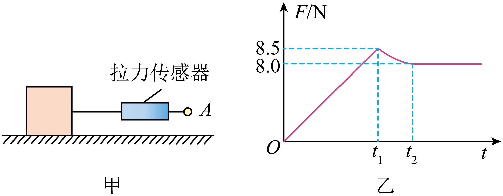

## 讲解

### 是什么

相互接触、挤压的粗糙表面发生相对滑动时，在接触面上产生阻碍相对滑动的力，叫滑动摩擦力。方向沿接触面，与受力物体相对另一接触物体滑动的方向相反。物体对地面静止，也可能因接触物在移动而受滑动摩擦。

在中学常用干摩擦模型中，大小为：

$$f_k=\mu N$$

fₖ、N以N计；这里N表示接触面的正压力大小，μ为无单位的动摩擦因数。μ由接触材料和表面状态决定；模型中不另乘接触面积。

### 怎么来的

实验在一定接触材料与表面状态下，测得滑动摩擦与正压力近似成正比，比值记为μ。若拖动木块匀速滑动，水平方向拉力与滑动摩擦平衡，测得拉力就能反求摩擦，再由μ=fₖ/N求因数。

法向压力必须先由受力分析确定。仅有重力与支持力、竖直无加速度的水平面物体有N=mg；斜面上一般为mg cosθ，另有向下压或向上提的力时还要增加或减少相应法向分量。不能把公式中的N直接理解成重力。

摩擦“阻碍”的是相对滑动，不保证它总让物体对地面的速度减小。传送带对落在其上的慢物体可施加沿传送带运动方向的摩擦，让物体加速；相对带的滑动却受到阻碍。[OpenStax摩擦力说明](https://openstax.org/books/university-physics-volume-1/pages/6-2-friction)用于核对方向与模型条件。

### 什么时候能用

确认已经相对滑动，且采用题设的恒定μ模型。静摩擦不能直接用μN决定实际大小；滑动停止后可能转成静摩擦。真实表面在复杂速度、温度、润滑状态下未必严格服从此近似，普通高中题以题设为准。

## 例题

> 题目与解析：第三章 相互作用（复习讲义）（解析版）.docx，来源ID S06，第147—158段。题目背景与原资料标注照录。

【变式3-1】（多选）如图甲所示，通过一拉力传感器（能测量力大小的装置）水平向右拉一水平面上质量为5.0kg的木块，A端的拉力均匀增加，0~$t_{1}$时间内木块静止，木块运动后改变拉力，使木块在$t_{2}$后做匀速直线运动。计算机对数据拟合处理后，得到如图乙所示拉力随时间变化的图线，下列说法正确的是（　　）（取$g=10\,\mathrm{m/s^2}$）

A．当F=6.0N时，木块与水平面间的摩擦力$f_{1}$=6.0N

B．若继续增大拉力至F=10.0N，则木块与水平面间的摩擦力$f_{2}$=6.0N

C．木块与水平面间的动摩擦因数为μ=0.16

D．木块与水平面间的动摩擦因数为μ=0.17

**原资料答案：** AC

**原资料详解：** 

A．当F=6.0N时，由图像可知，木块处于静止状态，根据平衡条件，木块与水平面间的摩擦力$f_{1}$=F=6.0N，故A正确；

B．木块在$t_{2}$后做匀速直线运动，则木块所受滑动摩擦力大小为8.0N，若继续增大拉力至F=10.0N，由图像可知，木块受到滑动摩擦力的作用，大小为$f_{2}$=8.0N，故B错误；

CD．根据滑动摩擦力大小为$f_2=\mu N=\mu mg$

结合上述解得$\mu=0.16$，故C正确、D错误。

故选AC。

### 顺着本题再看清一步

**答案：AC。** A拉力6 N时未滑动，静摩擦与拉力平衡为6 N；B拉力10 N时已滑动，摩擦仍8 N而非6；C用匀速段8 N除正压力5×10=50 N，μ=0.16成立；D的0.17来自将8.5 N峰值当滑动摩擦，混淆两种摩擦。

## 易错

- 拉力增到10 N后木块仍滑动，滑动摩擦由μN保持8 N，不能随拉力也变成10 N。
- 8.5 N峰值是最大静摩擦，匀速后的8 N才是计算动摩擦因数的依据。
- 本题只有水平拉力，竖直平衡才有N=mg=50 N；不能把此关系照搬到任意受力场景。
