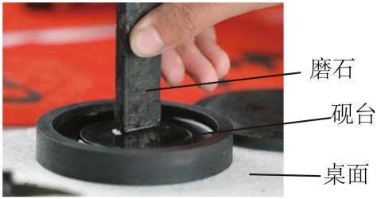

## 讲解

### 是什么

两个物体之间相互作用的一对力，总是大小相等、方向相反，作用在同一条直线上，分别作用于两个物体。称为作用力与反作用力；把哪一个叫作用力只是命名选择，不表示它先发生、另一个随后发生。

$$\vec F_{A\to B}=-\vec F_{B\to A}$$

下标A→B表示“A对B”，B→A表示“B对A”；两力单位均为N。要认出这一对，先交换施力、受力物体，而不是只找两个方向相反的箭头。

### 怎么来的

把两个弹簧测力计互相连接并拉动，二者示数始终相同，改变拉力后也相同；它们互相拉的力方向相反。这种实验表现出相互作用的对称性，推广得到牛顿第三定律。在高中经典力学范围内，无论二者静止、匀速或加速，这一对力的大小关系都不依赖它们的质量或运动状态。

相同的力作用于不同质量物体，运动变化可以不同，所以“两个作用力相等”不等于“两物体加速度相等”。静止物体也可以对运动物体施力，原题砚台与移动磨石就是这样的接触。

若只研究砚台，画磨石对砚台的摩擦，不画砚台对磨石的反作用；研究磨石时才画后者。若把两者合成一个整体，这一对成为内部力，在整体受力方程中互相抵消；它们仍真实存在，不能说因抵消就没有作用。[OpenStax牛顿第三定律](https://openstax.org/books/university-physics-volume-1/pages/5-5-newtons-third-law)用于核对对象与内外力区别。

### 什么时候能用

先确认两力来自同一次相互作用、双方互为施力与受力物体。它们有相同性质，例如压力与支持力同为接触弹力；重力与桌面支持力来源不同，可能在同一物体上平衡，却不是第三定律力对。本章只按经典力学模型应用。

## 例题

> 题目与解析：高一上物理第三章  单元测试·基础卷（解析版）.docx，来源ID S10，第27—38段。题目背景与原资料标注照录。

3．产自肇庆端州的“端砚”是中国四大名砚之一，制作端砚时需要经过选料、制坯、设计、磨光等过程。如图，在磨光过程中，砚台始终静止在水平桌面上，用磨石均匀用力打磨砚台，当磨石水平向右运动时（　　）

A．磨石对砚台的摩擦力方向水平向左

B．桌面对砚台的摩擦力方向水平向左

C．砚台质量越大，桌面对砚台的摩擦力就越大

D．磨石对砚台的摩擦力和砚台对桌面的摩擦力是一对相互作用力

**原资料答案：** B

**原资料详解：** 

A．当磨石相对砚台向右运动时，磨石给砚台的摩擦力水平向右，A错误；

B．砚台相对桌面有向右运动的趋势，故砚台受到桌面的摩擦力水平向左，B正确；

C．静摩擦力与正压力无关，C错误；

D．磨石对砚台的摩擦力和砚台对桌面的摩擦力是三个物体间的相互作用，不是相互作用力，D错误。

故选B。

### 顺着本题再看清一步

**答案：B。** A磨石相对砚台向右滑，砚台受磨石向右摩擦，方向不是左。B砚台为维持静止，需桌面向左静摩擦，成立。C在磨石的作用不变且仍能静止时，水平平衡需求不因砚台质量增加自动增加，错误；不能由此说压力对静摩擦上限毫无影响。D磨石对砚台的反作用是砚台对磨石，而非砚台对桌面。

## 易错

- D两股摩擦力涉及磨石、砚台、桌面三个对象，施受双方没有互换，不是力对。
- 磨石运动、砚台静止并不影响它们的相互摩擦等大反向。
- 原解析C“静摩擦与正压力无关”仅能表达实际值由平衡需求决定，压力仍影响最大静摩擦。
