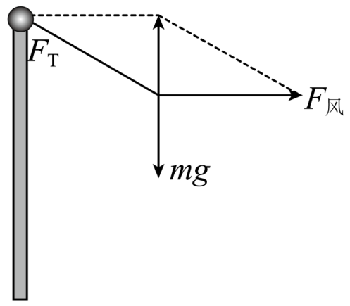
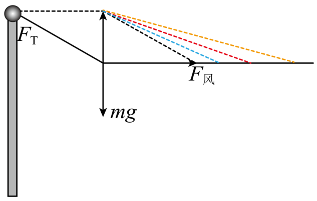

## 讲解

### 判据

题目让绳的夹角、支点位置、倾角“缓慢”改变，并按各时刻近似平衡分析时，先找恒定量与几何参数，再用平衡式研究未知力变化。若存在不可忽略加速度，就要改用动力学，不能把“运动中”一律当动态平衡。

### 流程

**说明近似状态。** 本题“徐徐升起”原详解按准静态/近似匀速模型处理，国旗各时刻合力取零。题干没有给加速度；若实际升旗加速度不可忽略，单靠绳角变化不能直接得到全部结论，此处沿用资料模型并明确前提。

**区分真实作用，找恒量。** 下绳近乎松弛，按理想轻绳模型张力取零。国旗受重力G、上绳拉力T和水平风力W；质量及当地g不变，G恒定，上绳与竖直旗杆夹角α增大。

**在固定轴上列式。** 拉力竖直分量平衡重力，水平分量平衡风力：

$$T\cos\alpha=G,\qquad W=T\sin\alpha$$

第一式两边除cosα，得T=G/cosα；再代第二式，得W=Gtanα。角度应在图示0≤α<90°范围内，若达到水平拉绳，有限拉力无法提供所需竖直分量。

**分析哪个量确实变大。** α增大、cosα变小且为正，所以T增大；tanα增大，所以W增大。不是“绳力增大导致合力增大”，因为它的增加正是为了继续平衡固定重力与变化风力，净合力仍近似零。

**用图解交叉看。** 以固定竖直重力边构造力三角形，绳的斜边更偏水平时，要更长的斜边才有同一竖直高度；水平边也更长。图解与分量式结论相同，且能提醒角度、正负和临界限制。

## 例题

> 题目与解析：高一上物理第三章  单元测试·基础卷（解析版）.docx，来源ID S10，第85—97段。题目背景与原资料标注照录。

8．在一次学校的升旗仪式中，小明观察到拴在国旗上端和下端各有一根绳子，随着国旗的徐徐升起，上端的绳子与旗杆的夹角在变大，下端的绳子几乎是松弛的，如图所示。设风力水平，两绳重力忽略不计，由此可判断在国旗升起的过程中（　　）

A．风力在逐渐增大

B．上端的绳子的拉力先减小后增大

C．上端的绳子的拉力在逐渐增大

D．国旗受到的合力增大

**原资料答案：** AC

**原资料详解：** 由题知下端的绳子几乎是松弛的，则该段绳子没有拉力，将国旗看作质点对其做受力分析有

随着国旗的徐徐升起，上端的绳子与旗杆的夹角在变大，根据图解法有

由上图可看出随着上端的绳子与旗杆的夹角在变大，风力$F_{\text{风}}$也逐渐增大、上端绳子的拉力$F_{T}$也逐渐增大，国旗受到的合力0。

故选AC。

### 顺着本题再看清一步

**答案：AC（沿用原详解近似平衡模型）。** A风力Gtanα随α增大，正确；C拉力G/cosα增大，正确。B没有先减后增的阶段，故错；D把个别力的增长当净合力增长，原模型始终近似平衡，故错。若实际有未知加速度，竖直平衡式须改为Tcosα−G=may，不能仍由α单独判断T。

## 易错

- 下绳画在图上但松弛，不应强添非零拉力。
- 两股外力变大不等于合力变大；准静态的矢量和仍为零。
- 原题结论依赖原详解的平衡近似，不能推广到任意突然加速的升旗过程。
