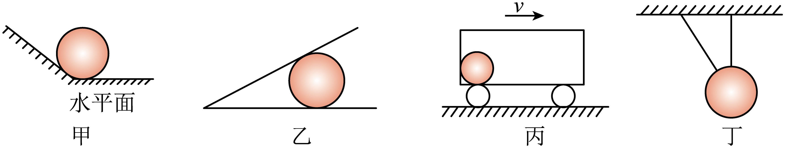

## 讲解

### 判据

物体接触、绳连接、球与壁相碰时，问“是否有弹力”或“弹力朝哪边”，要同时检查接触与弹性挤压/拉伸。接触本身不是充分条件，图上贴在一起也可能没有法向挤压。

### 流程

**明确施受双方及接触位置。** 先问球受到哪一面或哪根绳的作用。普通光滑点面接触的弹力沿该面的法线，指向阻止相互穿透的一侧；曲面在接触点取切面法线。原讲义第29段写“相切”是错误，应是垂直。

**明显形变时按恢复形变方向。** 绳只沿绳拉、不推；压缩弹簧向外推，拉长弹簧向回拉。普通受约束杆不能一概沿杆，须看杆模型、铰接和是否为两力构件。

**不明显时用状态与假设。** 假设拿开某一接触约束，若物体在其余力下将穿向该面，说明实际需要支持；若其余力已能保持原状态，且该面没有提供非零力的平衡需要，则该接触力可为零。假设法要与完整受力相互检验，不能只凭“看起来贴着”。

假设法适用于本章的理想、可由平衡确定的接触模型。多支撑或带预紧的系统，拿掉一个支撑后仍能平衡，不证明原先该支撑一定无力；这时还需形变或约束信息，不能单用拿掉法。

**写分量平衡排除多余力。** 本题几个球均无水平加速度。甲、乙已有水平底面支持力平衡重力，若再添一个单侧斜面弹力，其水平分量无人抵消，所以它须为零。丙匀速随车，左壁不能凭“跟着走”就对球施力；匀速无需水平合力。

**读零力绳的含义。** 丁只有竖直绳即可平衡重力，斜绳一旦有张力，会产生无可平衡的水平分量，故斜绳张力为零。不要为了让每根画出的线都有用而强添力。

## 例题

> 题目与解析：第三章 相互作用（复习讲义）（解析版）.docx，来源ID S06，第110—121段。题目背景与原资料标注照录。

【例2】下面对物体的受力情况描述正确的是（    ）

A．图甲中，光滑小球和斜面之间可能有弹力作用

B．图乙中，小球静止在光滑的三角槽中，三角槽底面水平，倾斜面对小球无弹力

C．图丙中，小球随车厢（底部光滑）一起向右做匀速直线运动，则车厢左壁对小球有弹力

D．图丁中，小球被两轻绳悬挂而静止，一轻绳处于竖直方向，倾斜轻绳对小球有拉力作用

**原资料答案：** B

**原资料详解：** 

A．由平衡条件可知，小球只受到重力和水平面的支持力，光滑小球和斜面之间没有弹力作用，故A错误；

B．由平衡条件可知，小球只受到重力和三角槽底面的支持力，倾斜面对小球无弹力，故B正确；

C．小球随车厢（底部光滑）一起向右做匀速直线运动，小球只受重力和支持力，则车厢左壁对小球没有弹力，故C错误；

D．由平衡条件可知，小球只受到重力和竖直绳的拉力，倾斜轻绳对小球没有拉力作用，故D错误。

故选B。

### 顺着本题再看清一步

**答案：B。** A斜面弹力的水平分量无力抵消，故不存在；B底面支持与重力已经平衡，倾斜面无弹力，成立。C随车匀速a=0，球只受重力与底部支持，左壁压力零。D斜绳有拉力便出现无对应反向水平分量，所以拉力零，题述错误。图中接触有无都以原资料给定静止/匀速状态为前提。

## 易错

- 原讲义“弹力与接触面相切”应改为法线方向；沿面方向要另检查摩擦。
- 光滑只排除摩擦，不排除法向支持。
- 匀速不需要前进方向的维持力，丙不能因随车向右就判左壁有压力。
