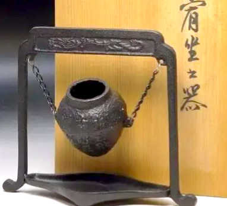

## 讲解

### 判据

题目问重心是否在物体上、是否等于几何中心、形状或装载改变后怎样移动时，抓住“质量分布的等效作用点”。不要只凭外形名称或“最重的位置”判断。

### 流程

**先定义系统。** 是容器本身，还是容器连同其中的水？加水若把水计入系统，重心可随水的质量和位置变化；若只讨论容器本身且形状不变，其质量分布并没有因加水自动改变。

**查均匀与对称条件。** 规则且质量分布均匀时，重心可由对称确定；非均匀物体不能直接取几何中心。铁环均匀时重心在圆心，这个位置可以没有物质，所以“重心必在壁上”不能成立。

**用等效含义排除错误定义。** 各部分都受重力，重心只把分布作用等效集中；不是最重的一点，也不是全部质量真实挤在一点。

**判断分布变化。** 本题欹器注水，原解析将“容器加水”作为整体，按此器型的分布先降低后升高。这个结果对应特定器型及装水状态，不能推广为所有容器加水都如此；只给一般容器、没有形状和质量分布时，无法指定全部变化规律。

**重力方向另判。** 物体倾斜、重心移动均不把重力方向改成沿器壁，重力始终沿当地竖直向下。若实验定位薄板，可从不同悬点画铅垂线，以交点找重心。

## 例题

> 题目与解析：第三章 相互作用（复习讲义）（解析版）.docx，来源ID S06，第84—95段。题目背景与原资料标注照录。

【变式1-1】（多选）如图所示的欹（qī）器是古代一种倾斜易覆的盛水器。《荀子·有坐》曾记载“虚则欹，中则正，满则覆”。下列分析正确的是（    ）

A．未装水时欹器的重心一定在器壁上

B．欹器的重心是其各部分所受重力的等效作用点

C．往欹器注水过程中，欹器重心先降低后升高

D．欹器倾倒的时候，其重力方向偏离竖直方向

**原资料答案：** BC

**原资料详解：** 

A．未装水时欹器的重心不一定在器壁上，也有可能在瓶子内部某处，故A错误；

B．根据重心的定义，欹器的重心是其各部分所受重力的等效作用点，故B正确；

C．往欹器注水过程中，欹器包括水）的重心先降低再逐渐升高，故C正确；

D．欹器倾倒的时候，其重力方向一定处于竖直方向，故D错误。

故选BC。

### 顺着本题再看清一步

**答案：BC。** A把等效点必须有物质的想法套进重心，错误；B正是定义，成立。C沿用原题欹器与水的整体分布模型；资料没有给器壁各处质量和水面几何尺寸，不能据图进一步计算重心坐标。D把物体倾倒与重力方向改变混同，错误。

## 易错

- 空器重心可能在空腔，不一定在器壁，原题A错误。
- 注水判断先说明系统包括水，否则把不同对象的重心混作同一个量。
- 倾倒改姿态不改当地重力方向；D偏离竖直的说法错误。
