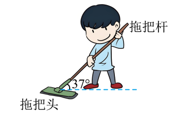

## 讲解

### 判据

要求“受几个力”“压力/摩擦大小或方向”“静止、匀速时哪个力怎样变化”，先明确受力对象。题目有杆、地面、绳、相邻物体时，列力的依据是相互作用来源，不是把图中所有箭头都搬进同一个图。

### 流程

**先隔离所求对象。** 原题求拖把头受力，把拖把头单独研究；杆对它的推力是外力，拖把头对杆的反作用不画进来。若研究若干物体整体，内部接触力应在整体图中省去；求内部力再隔离。

**按非接触与接触依次找来源。** 先地球重力mg，再看哪些物体与它接触：地板提供法向支持N和切向摩擦f，杆提供沿杆的推力F。每个力都能回答“谁对谁”，没有施力物体的所谓运动力不能添加。

**依接触性质定方向。** 光滑接触只提供法向弹力；粗糙相对滑动的接触还提供反向摩擦。原题拖把在地板上滑动，所以摩擦与它相对地板的滑动方向相反；杆向下推含水平和竖直两个分量，但仍是一股真实力。

**用状态检验是否漏力。** 拖把头匀速直线移动，合力零。水平由推力的水平分量平衡摩擦，竖直支持力要同时抵消重力和推力竖直分量：

$$N=mg+F\sin\theta,\qquad f=F\cos\theta$$

若错写N=mg，会漏掉杆的向下分量；若把F、Fsinθ、Fcosθ都计成三个力，会重复计数。角θ是杆与水平的夹角，故水平为邻边投影Fcosθ。

**再求所需未知量。** 确认滑动后用f=μN反求μ。最后检查单位、方向，以及N不能为负；若由方程算出需负支持力，说明接触或运动状态假设需改变。

## 例题

> 题目与解析：高一上物理第三章  单元测试·基础卷（解析版）.docx，来源ID S10，第167—179段。题目背景与原资料标注照录。

13．（8分）拖地的时候，遇到顽固污渍的地方，我们会使劲向下压拖把并前后滑动拖把，就有可能把污渍清除。如图所示，某人沿拖把杆方向以恒力$F=10\,\mathrm N$沿拖把杆推拖把头时，拖把头在地板上匀速移动。已知拖把杆与水平方向的夹角为$\theta=37^\circ$，拖把头的质量为$m=0.4\,\mathrm{kg}$，拖把杆质量可忽略，（$\sin37^\circ=0.6$，$\cos37^\circ=0.8$，取$g=10\,\mathrm{m/s^2}$）求：

(1)地面对拖把头的支持力大小；

(2)拖把头与水平地板间的摩擦力；

(3)拖把头与水平地板间的动摩擦因数$\mu$。

**原资料答案：** (1)10N；(2)8N，方向与拖把头运动方向相反；(3)0.8

**原资料详解：** （1）题意可知拖把头受到重力mg、地面对拖把头的支持力N、摩擦力f和恒力F而平衡，由平衡条件得$N=mg+F\sin\theta$

代入题中数据得$N=10\,\mathrm N$

（2）对拖把头，由平衡条件得$f=F\cos\theta$

代入题中数据得$f=8\,\mathrm N$

方向与拖把头运动方向相反；

（3）由滑动摩擦力公式有$f=\mu N$

联立以上得$\mu=\frac fN=\frac8{10}=0.8$

### 顺着本题再看清一步

**原题答案：** N=10 N，f=8 N且与运动反向，μ=0.8。看到“沿杆”“37°”先作水平、竖直分解；mg=0.4×10=4 N，向下分量10×0.6=6 N，所以支持力4+6=10 N。水平分量10×0.8=8 N，由匀速平衡得摩擦8 N。最后是μ=8/10=0.8，不能用重力4 N作分母。

## 易错

- 拖把头受四股真实力，两个分量不另算第五、第六股。
- 本题沿杆向下推，不是向上拉；竖直分量应增加正压力。
- 摩擦求出8 N还要回答方向：与拖把头相对地板运动反向。
