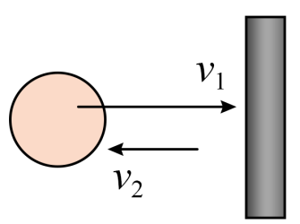

## 错法

反弹时把末速度仍写成正的15 m/s，于是计算15-20=-5 m/s，或者只用两个速率差的大小5 m/s。

这一步丢掉了“向右变成向左”的方向变化。速度变化量是矢量之差，不能只把两个大小相减。

## 正解

固定右为正，初速度+20 m/s、末速度-15 m/s，先末减初：

$$\Delta v=(-15)-20=-35\ \mathrm{m/s}$$

大小35 m/s，方向左。再除作用时间0.02 s，平均加速度-1750 m/s²。先保留符号确定方向，最后报大小；不能为了报正大小而先删掉方向。

## 例题

> 题目与解析：第一章 运动的描述（复习讲义）（解析版）.docx，来源ID S04，第314—325段。题目背景与原资料标注照录。

【变式8-2】乒乓球以20m/s的速度水平向右运动并碰到球拍，与球拍作用0.02s时间后反向弹回，弹回的速度大小为15m/s，关于乒乓球与球拍作用的过程，下列说法正确的是（　　）

A．乒乓球的速度变化量大小为5m/s，方向水平向左

B．乒乓球的速度变化量大小为35m/s，方向水平向右

C．乒乓球的加速度大小为250$\mathrm{m/s^2}$，方向水平向左

D．乒乓球的加速度大小为1750$\mathrm{m/s^2}$，方向水平向左

**原资料答案：** D

**原资料详解：** AB．选取水平向右的方向为正方向，则有$\Delta v=v_2-v_1=(-15-20)\,\mathrm{m/s}=-35\,\mathrm{m/s}$

即乒乓球的速度变化量大小为35m/s，方向水平向左，AB错误；

CD．根据加速度的定义，可得乒乓球的加速度为$a=\frac{\Delta v}{\Delta t}=\frac{-35}{0.02}\,\mathrm{m/s^2}=-1750\,\mathrm{m/s^2}$

即乒乓球的加速度大小为1750$\mathrm{m/s^2}$，方向水平向左，C错误，D正确。

故选D。

### 顺着本题再看清一步

A大小5错，B大小35但方向右错；C的250对应漏方向后的错误速率差，D大小1750、方向左正确。
