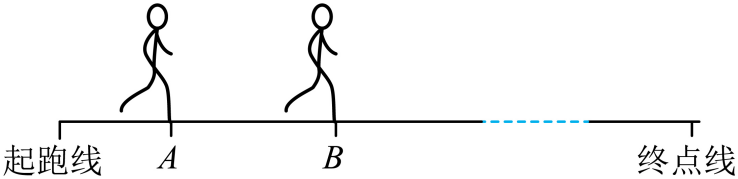

## 错法

只要题目给初速度和末速度，就自动使用 $(v_1+v_2)/2$，即使没有匀变速直线运动条件。

这个想法把特殊运动的计算式当成一般定义。端点速度没有告诉我们中间怎样运动，也没有告诉每个速度维持多久。

## 正解

首先按所问段的位移与经历时间计算平均速度：

$$\bar v=\frac{\Delta x}{\Delta t}$$

匀变速直线运动中才能由相应速度变化规律推出端点平均式。若题目未给这个条件，只给AB位移与时间，应直接使用定义；全程用时也不能替代AB段用时。

## 例题

> 题目与解析：第一章 运动的描述（复习讲义）（解析版）.docx，来源ID S04，第237—242段。题目背景与原资料标注照录。

【例6】在校运动会上，某同学以11.1s的成绩获得男子乙组100m冠军，比赛过程简化如图，测得他从A点到B点用时4s，在A点的瞬时速度大小为0.2m/s，在B点的瞬时速度大小为6.8m/s，AB间的距离为16m。则该同学在此4s内的平均速度大小是（　　）

A．1.7m/s

B．3.5m/s

C．4.0m/s

D．9.0m/s

**原资料答案：** C

**原资料详解：** 由题意，根据平均速度定义式可得该同学在此4s内的平均速度大小是$\bar v=\frac{x}{t}=\frac{16}{4}\,\mathrm{m/s}=4.0\,\mathrm{m/s}$

故选C。

### 顺着本题再看清一步

AB位移16 m、时间4 s，平均速度大小4.0 m/s，C正确。端点平均(0.2+6.8)/2=3.5 m/s正好是B，但AB没有匀变速条件，不能选。A、D不满足定义结果，原资料未给其独立错算来源。
