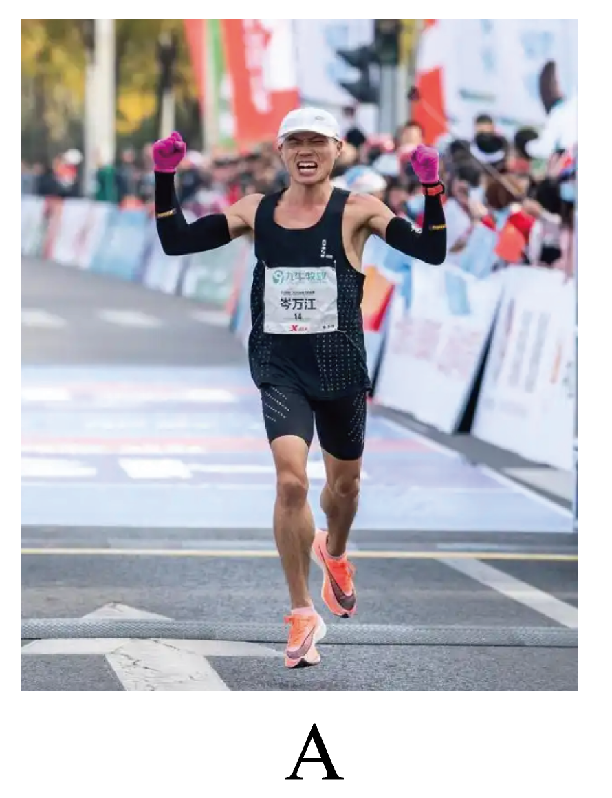
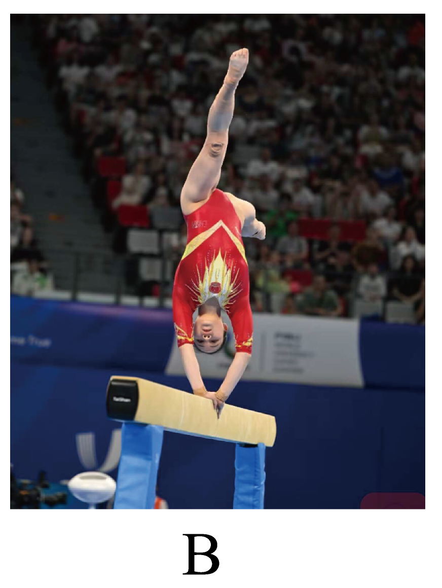
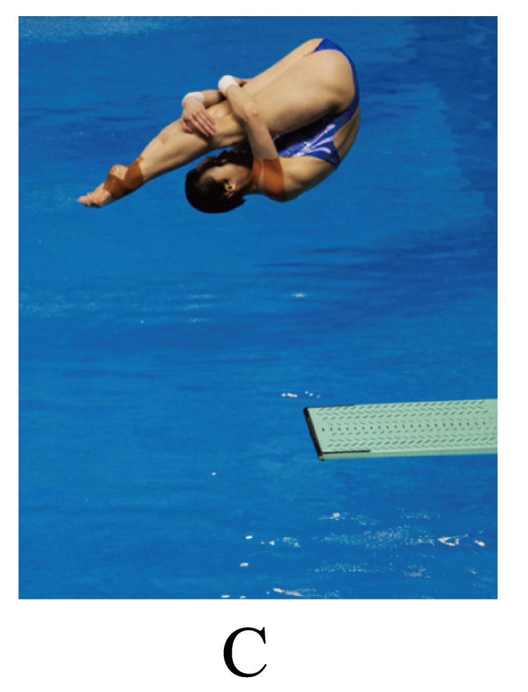
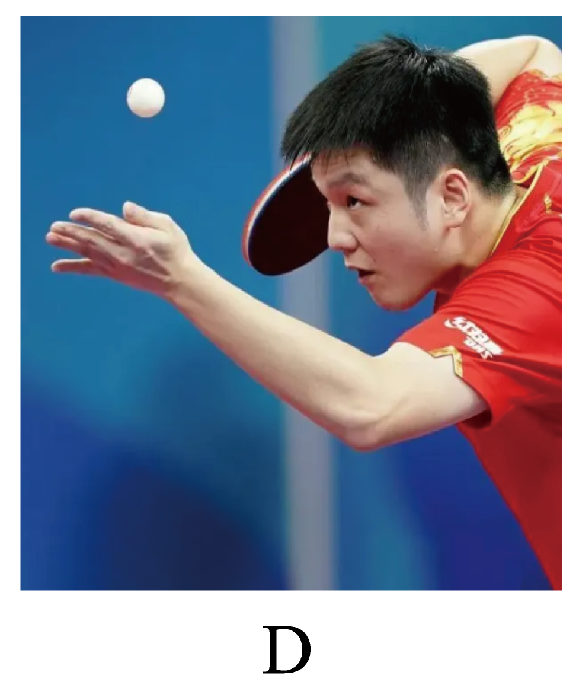

## 错法

把“质点”理解为体积很小的真实物体，于是认为运动员身体较大，绝不能作质点；或者认为乒乓球很小，研究旋转时也能作质点。

错在把模型条件从研究任务换成绝对尺寸。一个点能否够用，取决于题目要保留什么信息，不由照片里看起来大不大决定。

## 正解

先圈所研究的量，再判断删去形状和大小是否改变结果。全程时间、整体位置通常能由一个代表点描述；姿态、转动、手部动作不能。

同一个物体换了研究内容，可以从能作质点变成不能；质点仍保留质量。不要只答可或不可，要指出哪些身体细节是题目必需的。

## 例题

> 题目与解析：专题  运动的描述（专项训练）（解析版）.docx，来源ID S02，第27—36段。题目背景与原资料标注照录。

2．（24-25高一上·辽宁锦州·期末）“运动场上精彩纷呈，运动员们的表现各有千秋。”在研究下列情境时，可将运动员视为质点的是（　　）

A．记录马拉松运动员跑完全程的时间

B．观察体操运动员在平衡木上的动作

C．观看跳水运动员在空中的翻腾姿态

D．研究乒乓球运动员发球时的手部动作

**原资料答案：** A

**原资料详解：** 

A．记录马拉松运动员跑完全程的时间时，运动员的大小和形状可忽略不计，可把运动员看做质点，选项A正确；

BCD．观察体操运动员在平衡木上的动作时，或者观看跳水运动员在空中的翻腾姿态时，或者研究乒乓球运动员发球时的手部动作时，运动员的大小和形状都不能忽略不计，不能把运动员看做质点，选项BCD错误。

故选A。

### 顺着本题再看清一步

A记录马拉松整体用时，可忽略身体尺寸；B平衡木动作需身体姿态，C跳水需转动，D发球需手部运动。后三项都是题目要研究的内容，不能被一个点替掉。
