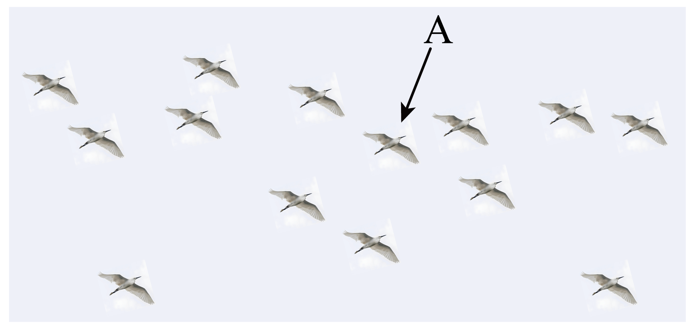

## 讲解

### 是什么

参考系是描述运动时选来作为参照的物体。说“运动”或“静止”，都要说明研究对象相对于什么；相对于这个参照物的位置改变，叫运动，不改变，叫静止。

研究对象是被描述的物体，参考系是拿来比较位置的物体，二者角色不同。同一物体可以相对于车厢静止、相对于地面运动，这两个判断并不矛盾。

### 怎么来的

仅知道“物体在某个地方”不能判定它怎样运动。必须连续比较它相对于某个物体的位置，才能看出位置是否随时间改变。

选定参考系后，计算时把参考系当作描述中的固定参照，再追踪研究对象。参照物在别的参考系里可以运动，例如飞行中的白鹭也能用作参考系。选择它作参照，不是宣布它相对于地面真的静止。

### 什么时候能用

同一道题的各段运动判断应使用明确的参考系。题目中“坐在车内”“以某鸟为参考”等词决定比较对象；通常以地面为参考，但题目另作指定时必须照题目选取。

参考系可以选择，选择的目的是让研究和描述方便；“任意选择”不等于得出的运动结论都相同，也不等于不说明选择。位置不变的判断要在所研究的整段时间内成立，不能只看某一个瞬间。

## 例题

> 题目与解析：专题  运动的描述（专项训练）（解析版）.docx，来源ID S02，第49—57段。题目背景与原资料标注照录。

5．（24-25高一上·浙江·期中）一群白鹭整齐的按“编队”在空中飞行，以其中一只白鹭A为参考系，下列说法正确的是（　　）

A．地面是静止的

B．左侧的白鹭是静止的

C．拍摄者是静止

D．前方的大山是静止的

**原资料答案：** B

**原资料详解：** 白鹭A在飞行，以白鹭A为参考系，地面、拍摄者和前方的大山是运动的。所有白鹭整齐飞行，相对静止，所以左侧的白鹭是静止的。

故选B。

### 顺着本题再看清一步

A地面、C拍摄者、D前方大山在地面参考系下通常静止，但题目参考系是飞行的白鹭A，它们与A的相对位置在改变，所以三项错误。B左侧白鹭与A整齐编队，相对位置保持不变，因此相对于A静止。判断依据是相对位置，不是“谁在照片里看起来没动”。

## 易错

- **参考系必须在地面静止**：飞行中的鸟也可以作参照，题目已指定时应沿用。
- **选了白鹭就说地面静止**：要比较地面与白鹭之间的位置，飞行使它们相对位置改变。
- **相对静止等于没有运动**：编队内部可相对静止，整个编队仍相对于地面运动。
