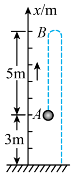

## 讲解

### 是什么

坐标系是建立在参考系上的位置标记方法。一维坐标系要规定**原点、正方向和单位长度**；坐标 $x$ 是位置标记，单位为米，不是物体运动过的路程。

同一点在不同原点下可以有不同坐标。正、负坐标表示点在原点哪一侧，不能据此判断物体正在向哪边运动。

### 怎么来的

参考系告诉我们“相对于什么描述”，坐标系进一步让位置能够用数字表示。沿直线选定原点和正方向后，把离原点的距离按所在方向写成正或负，就得到一维位置坐标。

要描述位置变化，设初、末坐标为 $x_1$、$x_2$，末位置相对于初位置的变化为：

$$\Delta x=x_2-x_1$$

更换原点会使两个坐标同时平移相同的量，作差时这项消掉，所以只改原点不改变位移；若把正方向反过来，位移的符号会反过来，实际运动没有改变。

### 什么时候能用

本条讨论沿一条直线的位置描述。先明确参考系，再选坐标原点和正方向，题目指定“向上为正”时不能中途改成向下。

读图时要区分坐标和位移。只有选初位置为原点、初坐标为零时，末坐标才等于该过程的位移；一般情况下必须作末减初。

## 例题

> 题目与解析：高一上物理第一章  单元测试·提升卷（解析版）.docx，来源ID S14，第51—65段。题目背景与原资料标注照录。

5．如图，从高出地面3m的A点竖直向上抛出一个小球，它上升5m后到达B点，然后回落，最后到达地面C。以竖直向上为正方向，下列叙述正确的是（　　）

A．若取地面C为坐标原点，A点的坐标$x_{A}$=3m，整个过程中，小球的位移为-3m

B．无论选择A、B、C中的哪一点作为坐标原点，整个过程中，小球的位移都等于3m

C．从A到B的位移大于从B到C的位移，因为正数大于负数

D．因为位移是矢量，从A到B的位移与从B到C的位移的大小无法比较

**原资料答案：** A

**原资料详解：** AB．若取地面C为坐标原点，A点的坐标为

$x_A=3\,\mathrm m$C点坐标为

$x_C=0$

则整个过程中，小球的位移

$\Delta x=x_C-x_A=0-3\,\mathrm m=-3\,\mathrm m$

且位移与坐标原点的选取无关，故A正确，B错误；

CD．从A到B的位移为5m，从B到C的位移为-8m，由于位移是矢量，正、负号表示位移的方向，而不表示位移的大小，所以从A到B的位移小于从B到C的位移，故CD错误。

故选A。

### 顺着本题再看清一步

取C为原点，A坐标为3 m，C坐标为0，故总位移为 $0-3=-3\ \mathrm m$，A正确。若换原点，差仍为-3 m，B把大小和带方向的位移混用。A到B为+5 m，B到C为-8 m；大小是5 m与8 m，不能用“正数大于负数”判断，故C错误；大小可以比较，D也错误。

## 易错

- **坐标改变就说运动改变**：换原点只是换标记，初末坐标之差不变。
- **末坐标直接当位移**：需要先减初坐标，本题从A到C不是只读C点坐标。
- **用正负比较位移大小**：正负表方向，大小要取绝对值。
