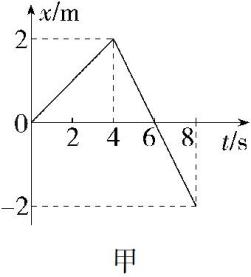
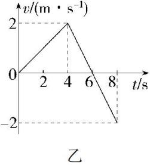

## 讲解

### 是什么

速度—时间图像横轴为时刻 $t$（秒），纵轴为速度 $v$（m/s）。纵坐标给速度，斜率给加速度，图线与时间轴间的带符号面积给位移，三种信息来自不同读图动作。

### 怎么来的

两个时刻的速度差除以时间差：

$$\bar a=\frac{v_2-v_1}{t_2-t_1}$$

这就是两点连线斜率，直线段加速度恒定，水平段加速度零。

恒速小时间段位移 $\Delta x=v\Delta t$ 对应长方形面积。把许多小段相加，就得到位移的带符号面积；轴上方为正、下方为负。路程则把各部分面积的大小相加。面积单位是m/s乘s，正好为米。

### 什么时候能用

判断方向看速度正负，不看斜率。图线下降但仍在时间轴上方，表示仍向正方向运动、速度减小；穿过时间轴才可能反向。

是否回到起点要看累计面积是否抵消，速度零不够。两条v-t图交点只表示速度相同，不自动表示位置相同。

## 例题

> 题目与解析：第一章 运动的描述（知识清单）（答案版）.docx，来源ID S06，第484—487段。题目背景与原资料标注照录。

【例6】如图所示，图甲为甲物体做直线运动的x-t图像，图乙是乙物体做直线运动的v-t图像。关于甲、乙两物体在前8s内的运动，下列说法正确的是(　　)

A. 4s末甲的运动方向发生改变

B. 4s末乙的运动方向发生改变

C. 前6s内甲的位移为6m

D. 6s末乙回到出发点

**答案：A。**

**原资料解析：** x-t图线的斜率表示速度，题图甲中4s末图线斜率的正负发生改变，甲的运动方向发生改变，A正确；题图乙中4s末物体的速度仍为正，运动方向没有改变，但开始做减速运动，B错误；6s末甲回到出发点，故前6s内甲的位移为零，C错误；0~6s内，乙一直沿正方向远离出发点，6~8s内沿反方向靠近出发点，6s末乙距离出发点最远，D错误。故选A。

### 顺着本题再看清一步

甲图4 s前斜率正、后斜率负，甲反向，A正确；乙4 s速度仍正，B错。甲6 s坐标回零，前6 s位移零，C错；乙0—6 s速度非负、累计位移正，6 s在距起点最远处，D错。

## 易错

- **4秒图线下降就反向**：乙速度仍正，B错。
- **6秒速度零就回到起点**：累计位移仍正，D错。
- **x-t斜率与v-t纵坐标混用**：图形相似但轴不同。
