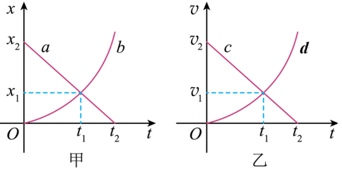

## 讲解

### 判据

两物体的v-t图在同一时间段内，要求比较位移时，比较图线与时间轴围成的带符号面积。比较路程则比较绝对面积累计，不能直接用终点速度或斜率大小判断。

### 流程

**先确认同一个时间范围和方向约定。** 只有范围一致，面积比较才对应同一段位移。

**把位移理解为各小段的累计。** 每个近似匀速小段 $\Delta x=v\Delta t$ 对应一个窄长方形面积，累计这些面积得到总位移。正速度部分为正，负速度部分为负。

**面积能直接比较就不用臆算数值。** 若一条图线在整段都高于另一条且二者速度均正，前者面积更大，位移更大；两线交叉时要分段，不能只看最后一刻。

**需要相遇时加上初位置。** 位移大小关系与位置关系不是同一问题。图像交点给的是瞬时速度相等，并不代替面积判断。

**不要把坐标种类混用。** x-t的纵坐标差给位移，v-t的面积给位移；先认轴再操作。

## 例题

> 题目与解析：第一章 运动的描述（知识清单）（答案版）.docx，来源ID S06，第488—493段。题目背景与原资料标注照录。

【针对训练6】a、b两个物体在同一条直线上运动，两物体的位移x随时间t变化的关系图像如图甲所示；c、d两个物体在另一条直线上运动，两物体的速度v随时间t变化的关系图像如图乙所示，其中b、d均为抛物线。下列分析正确的是(　　)

A. 0～$t_{1}$时间内，a、b两物体运动方向相反，c、d两物体运动方向相同

B. 0～$t_{1}$时间内，a、b两物体通过的位移相同，c的位移大于d的位移

C. $t_{2}$时刻物体a的速度为零，物体c的加速度为零

D. 0～$t_{2}$时间内，b的加速度不变，d的加速度逐渐变大

**答案：AD。**

**原资料解析：** 0～$t_{1}$时间内，a物体沿$x$轴负方向运动，b物体沿$x$轴正方向运动，a、b两物体运动方向相反。速度正负表示方向，c、d两物体速度均为正值，故两者运动方向相同。故A正确；0～$t_{1}$时间内，a、b两物体通过的位移大小分别为${x}_{b}={x}_{1}-0={x}_{1}$，${x}_{a}={x}_{2}-{x}_{1}$，a物体位移方向沿$x$轴负方向，b物体位移方向沿$x$轴正方向，a、b两物体通过的位移不相同。速度时间图像与坐标轴围成的面积表示位移，0～$t_{1}$时间内，c的位移大于d的位移。故B错误；0～$t_{2}$时间内物体a的位移图像是一条倾斜的直线，故物体a一直在做匀速直线运动，$t_{2}$时刻物体a的速度不为零。0～$t_{2}$时间内物体c的速度图像是一条倾斜的直线，故物体c一直在做匀减速直线运动，$t_{2}$时刻物体c的加速度不为零。故C错误；0～$t_{2}$时间内，物体b位移图像是一条抛物线，由$x=\frac{1}{2}a{t}^{2}$，得b的加速度不变，0～$t_{2}$时间内，物体b做初速度为零的匀加速直线运动。0～$t_{2}$时间内，物体d速度图像是一条抛物线，斜率表示加速度，斜率越来越大，d的加速度逐渐变大。故D正确。故选AD。

### 顺着本题再看清一步

A正确：x-t里a斜率负、b斜率正，方向相反；v-t里c、d都在轴上方，方向相同。B把a、b的有方向位移当相同，错误；虽然其中“c位移大于d”确实成立，也不能让整个B正确。C错：a的x-t直线斜率非零、c的v-t直线斜率也非零。D正确：b的x-t抛物线对应恒定加速度，d的v-t抛物线斜率逐渐增大。

## 易错

- **c、d在t₁速度相等就位移相等**：之前c速度更大，面积更大。
- **负面积也直接加为正位移**：那样算的是路程。
- **图线终点高就整段面积大**：应看整个指定范围。
