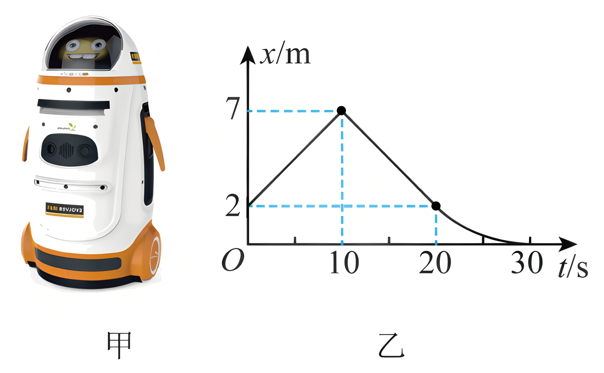

## 讲解

### 判据

x-t图给出一段运动的初末位置，要求位移时，直接取末纵坐标减初纵坐标。不要沿图线算长度，也不要把图线与时间轴之间面积当位移。

### 流程

**找所问段的两个时刻。** 在横轴上定位 $t_1$、$t_2$，分别读对应位置 $x_1$、$x_2$；不能把整图初末替代某一局部段。

**按位移定义作末减初。**

$$\Delta x=x_2-x_1$$

差值正负表示方向，报大小时取绝对值。图线中间再复杂也不改变这段总位移的初末关系。

**初值不为零时尤其要减。** 只有以该段初位置为原点、$x_1=0$ 时，末坐标才直接等于这段位移。

**区分路程。** 要求路程时应逐段累计位置变化大小，不能用总位移大小替代；x-t图的“图线长度”同时掺入时间与位置轴，根本不是实际路程。

## 例题

> 题目与解析：第一章 运动的描述（知识清单）（答案版）.docx，来源ID S06，第518—522段。题目背景与原资料标注照录。

5.智能机器人已经广泛应用于宾馆、医院等服务行业，用于给客人送餐、导引等服务，深受广大消费者喜爱。如图甲所示的医用智能机器人沿医院走廊运动，图乙是该机器人在某段时间内的位移—时间图像，则机器人(　　)

A. 在0~30s内的位移是2m

B. 在0~10s内做匀加速直线运动

C. 在20~30s内，运动轨迹为曲线

D. 在10~30s内，平均速度大小为0.35m/s

**答案：D。**

**原资料解析：** 位移是指从初位置到末位置的有向线段，0～30s内的机器人的初位置为2m，末位置为0m，故该段时间内机器人的位移是-2m，负号表示方向与正方向相反，故A错误；x-t图像的斜率表示速度，在0～10s内做匀速直线运动，故B错误；x-t图像描述的是直线运动，在20～30s内机器人朝负方向运动，运动轨迹为直线，故C错误；平均速度等于位移与时间的比值，在10～30s内，位移大小等于7m，时间为20s，平均速度大小为$\bar v=\frac{x}{t}=\frac{7}{20}m/s=0.35\,\mathrm{m/s}$，故D正确。

### 顺着本题再看清一步

0—30 s：$x_1=2\ \mathrm m$，$x_2=0$，位移-2 m，A所给+2 m错误。10—30 s：初7 m、末0，位移-7 m，平均速度-0.35 m/s，其大小0.35，D正确。B、C分别错在斜率含义和图像不是轨迹。

## 易错

- **末坐标零就位移零**：0—30 s初值为2 m，位移-2 m。
- **读成位移大小而漏方向**：题问位移要保留符号。
- **拿x-t面积当位移**：只有v-t带符号面积对应位移。
