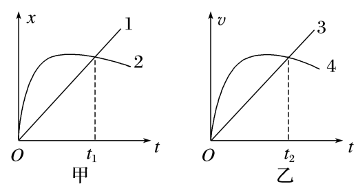

## 讲解

### 判据

两物体在同一直线上、共用同一参考系和坐标原点，题目问“相遇”时，要比较同一时刻的位置。x-t交点与v-t交点不是同一种事件。

### 流程

**第一步，确认图的纵轴。** x-t纵轴位置，交点表示同一时刻同一位置，可判相遇；v-t纵轴速度，交点只表示同一时刻速度相同。

**第二步，v-t图还要查初位置与累计位移。** 相遇条件是：

$$x_{1,0}+\Delta x_1=x_{2,0}+\Delta x_2$$

若从同一地点出发，条件化为累计位移相等，可比较同一时间内的带符号面积。若初位置不同，还要保留初位置差，不能只说面积相等就相遇。

**第三步，把某时刻相等与某段平均相等分开。** 两条x-t曲线同起点、同终点时，该段平均速度相等，不代表沿途各时刻速度相等。

**第四步，答案写清图型依据。** 说明是“位置相同”还是“速度相同但面积不同”，避免只说“两线交了”。

## 例题

> 题目与解析：第一章 运动的描述（知识清单）（答案版）.docx，来源ID S06，第524—529段。题目背景与原资料标注照录。

6.图甲为位移—时间图像，图乙为速度—时间图像，图中给出的四条图线1、2、3、4分别代表四个物体从同一地点出发做直线运动的情况，下列说法正确的是(　　)

A. 甲图中，0至$t_{1}$时间内，物体2的平均速度大于物体1的平均速度

B. 甲图中$t_{1}$时刻物体1和物体2相遇

C. 乙图中，$t_{2}$时刻物体3与物体4相遇

D. 乙图中，0至$t_{2}$时间内，物体3和物体4的平均加速度相等

**答案：BD。**

**原资料解析：** 题图甲中，0~$t_{1}$时间内两物体位移Δx相等，由$\frac{\Delta x}{\Delta t}$知平均速度相等，A错误；$t_{1}$时刻，两物体到达同一位置，即相遇，B正确；题图乙中，0~$t_{2}$时间内物体3的速度总小于物体4的速度，而物体3、4从同一地点出发做直线运动，则$t_{2}$时刻两物体不会相遇，C错误；由a=$\frac{\Delta v}{\Delta t}$知，0~$t_{2}$时间内物体3和物体4的平均加速度相等，D正确。故选BD。

### 顺着本题再看清一步

甲图1、2同地出发、t₁同位置，位移相等，所以平均速度相等，A错误，B正确。乙图3、4虽然t₂速度相等，但之前4一直较快、面积较大，位置不同，C错误。两者初末速度及时间相同，因此平均加速度相等，D正确。

## 易错

- **v-t交点自动相遇**：原题C错，3、4累计位移不同。
- **x-t终点相同就全程速度相同**：只能支持该段平均速度关系。
- **初位置不同却只比面积**：还要加上初位置。
