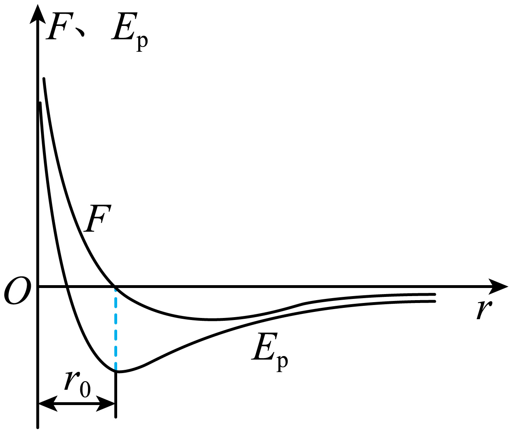

## 错法

把F=0误当Eₚ=0，觉得“没有力就没有势能”。错误在于混淆势能曲线高度与斜率，并忘记零点约定。

## 正解

分子合力零发生在r₀，引力、斥力彼此平衡而非各自消失。此处势能最低；取远处为零时最低值为负，不能凭F零改成0。

也可以另选r₀势能零，但那是人为平移参考值，远处就不再为零。$\Delta E_p=-W$ 在两种选法下相同，力和运动判断也相同。

## 例题

> 题目与解析：第一章  分子动理论（专项训练）（解析版）.docx，来源ID S02，第235—246段。分段选取时保留该子问的完整题干、答案与解析；题目背景和原资料标注照录。

18．（多选）（24-25高二下·四川绵阳·期末）如图所示是分子间的分子力$F$与分子势能$E_p$随分子间距离$r$变化的关系示意图。下利关于分子力$F$和分子势能$E_p$的描述，正确的是（　　）

A．当$r=r_0$，$F=0$，$E_p$最大

B．当$r<r_0$，分子间仍然存在引力的作用

C．当$r>r_0$，随着$r$的增大，$F$和$E_p$均增大

D．当$r<r_0$，随着$r$的减小，$F$和$E_p$均增大

**原资料答案：** BD

**原资料详解：** 

A．根据图像可知，当$r=r_0$时，分子力$F$为0，分子势能$E_p$最小，A错误；

B．分子间引力和斥力同时存在，当$r<r_0$时分子力的合力为斥力，但存在引力，B正确；

C．当$r>r_0$时，随着距离$r$的增大，$F$可能先增大后减小，也可能逐渐减小，$E_p$逐渐增加，C错误；

D．当$r<r_0$时，随着距离$r$的减小，$F$逐渐增大，$E_p$逐渐增大，D正确。

故选BD。

### 顺着本题再看清一步

A在r₀合力为零，势能最小，非最大；B在r<r₀合力虽表现为斥力，引力仍存在；C在引力区增大r，势能升高，但引力大小不是始终增大，故排除；D在斥力区进一步缩短r，斥力和势能都增大。答案BD。图F为带符号合力，讨论“大小增减”时还要看绝对值。
