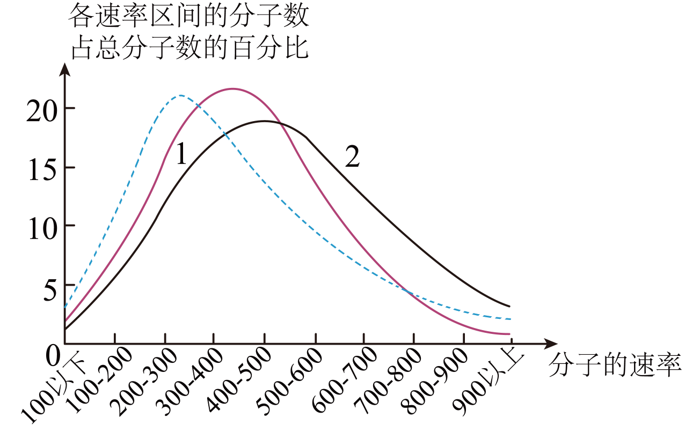

## 讲解

### 是什么

分子平均动能是大量分子热运动动能的统计平均，用J；它与某一个分子的瞬时动能不同。高中温度判断讨论热运动的统计强弱，不把物体整体平动速度算入热运动动能。

### 怎么来的

理想气体压强公式 $p=2n\overline{E_k}/3$，与状态关系 $p=nk_BT$ 比较，约去数密度，得到

$$\overline{E_k}=\frac32k_BT.$$

此式是经典理想气体的平均平动动能，T用K，kB单位J/K。多原子分子转动、振动等内部自由度可另贡献能量，不能把上式当所有物态每分子全部内部能量的普遍表达式。

相同T时平均平动动能相同，但 $\overline{v^2}=3k_BT/m$，分子质量越大，同温均方根速率越小。平均动能相同不等于平均速率相同。

### 什么时候能用

同一物质温升，统计平均热运动动能增大；同温相变，教材平均动能不变，内能可因分子相互作用与排列变化而改变。单分子可能碰撞后减速，不能拿这个随机事件否定温度统计结论。

平均动能乘分子数才是对应的总动能。比较不同大小物体时，温度较高不自动使总内能较大。

## 例题

> 题目与解析：第一章  分子动理论（专项训练）（解析版）.docx，来源ID S02，第89—100段。分段选取时保留该子问的完整题干、答案与解析；题目背景和原资料标注照录。

8．（23-24高二下·湖北十堰·期末）1934年我国物理学家葛正权定量验证了麦克斯韦的气体分子速率分布规律。氧气在不同温度下的分子速率分布规律如图所示，图中实线1、2对应氧气的温度分别为$T_1$，$T_2$，下列说法正确的是（    ）

A．$T_1$小于$T_2$

B．同一温度下，氧气分子的速率分布呈现出“中间少，两头多”的分布规律

C．实线1与横轴围成的面积大于实线2与横轴围成的面积

D．温度为$\frac{T_1+T_2}{2}$的氧气的分子速率分布规律曲线可能是图中的虚线

**原资料答案：** A

**原资料详解：** 

A．图中曲线峰值所对应的分子速度越大，温度越高，所以$T_1$小于$T_2$，故A正确；

B．同一温度下，氧气分子的速率分布呈现出“中间多，两头少”的分布规律，故B错误；

C．实线1与横轴围成的面积等于实线2与横轴围成的面积，故C错误；

D．温度为$\frac{T_1+T_2}{2}$的氧气的分子速率分布规律曲线应该位于实线1与实线2之间，不可能为图中虚线，故D错误。

故选A。

### 顺着本题再看清一步

曲线1峰靠左且较高，曲线2峰右移变宽，说明T₁<T₂，A正确；B把中间多、两头少写反；C在同样统计口径下两条完整分布总比例相同；D平均温度应产生介于两者的分布，图中虚线却偏向更低速一侧，错误。峰值位置是最概然速率，不是每个分子的速率，也不直接等于平均速率。

## 易错

统计分布右移反映平均增强，不能推出每个分子更快。温度公式比例用K，不能把0℃代成T=0。
