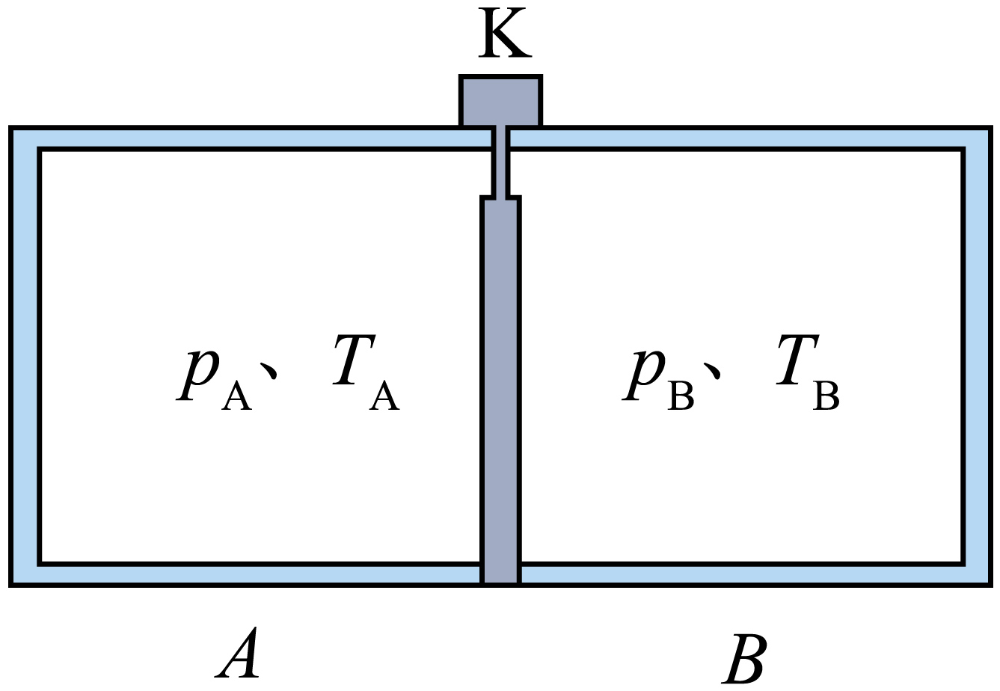

## 讲解

### 判据

气体压强与分子运动、数密度、容器体积关联，或问失重后压强。先写理想平衡模型 $p=nk_BT$，区分n=N/V与总N。

### 流程

1. 定质量、定体积升温，n不变，平均动能增大，单位面积单位时间总撞击冲量增大，p增大。
2. 定温、定分子数压缩，平均动能不变，n增加，碰撞频度增加，p增大。若体积变化同时温度也变，不能只比较n。
3. 不同气体同温同数密度时理想压强相同；轻分子速率大，但单次动量与质量共同决定，不能只以平均速率排序压强。
4. 互通达到平衡时，比较最终p、T而非保留初始大小关系；同种气体最终n也相同。
5. 完全失重仍有随机碰撞，不将压强直接归零。气柱重力与分子撞击是宏观平衡与微观机制的两种层次。

分子作用明显或非平衡时须另核模型。

## 例题

> 题目与解析：第一章  分子动理论（专项训练）（解析版）.docx，来源ID S02，第102—111段。分段选取时保留该子问的完整题干、答案与解析；题目背景和原资料标注照录。

9．（24-25高二下·山西太原·期末）如图所示，一个密闭绝热容器用固定挡板隔开分成A、B两部分，容器中的气体为同种气体，它们的压强$p_A>p_B$、温度$T_A<T_B$。打开挡板上的开关K，使两部分互通，经过足够长的时间，再闭合开关。此时关于A、B两部分容器，下列说法正确的是（　　）

A．A、B两部分容器内分子的数密度不相同

B．A、B两部分容器内分子的平均动能不相等

C．A、B两部分容器壁单位面积上受到气体分子平均作用力的大小相等

D．A、B两部分容器壁单位面积上在单位时间内受到气体分子平均冲量的大小不相等

**原资料答案：** C

**原资料详解：** ABC．两部分气体达到平衡状态时，压强、温度、密度都相同，因此A、B两部分容器内分子的数密度相同、平均动能相等、单位面积上受到气体分子平均作用力的大小相等，故AB错误，C正确；

D．由于最终两部分气体压强相等，则A、B两部分容器壁单位面积上在单位时间内受到气体分子平均冲量的大小相等，故D错误。

故选C。

### 顺着本题再看清一步

互通足够久后达到热、力学平衡，同种气体两区温度与压强相同。由理想气体p=nkBT，数密度也相同，A、B错误；单位面积平均力就是压强，C正确；单位面积单位时间的总冲量也是压强，D错误。不能凭两区体积不同就判分子数密度不同。

## 易错

两容器最终总分子数可因V不同而不同，但数密度相同。温度和数密度都变时缺数据不能只凭某一个因素下结论。
