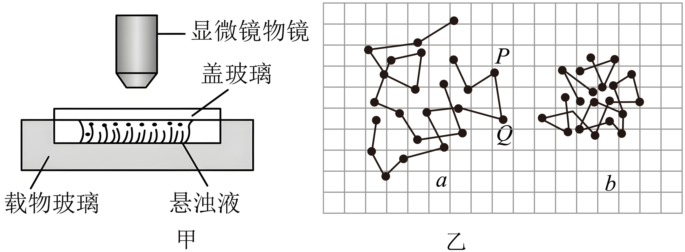

## 讲解

### 判据

观察到两种物质混合、悬浮微粒不规则位移或显微镜轨迹图，要求识别热运动证据。先问“被观察的是谁”。

### 流程

1. 若观察物质成分彼此进入，是扩散；若观察悬浮微小颗粒运动，是布朗运动。扩散归因于分子热运动，布朗运动由介质分子不平衡碰撞间接反映热运动。
2. 若粒子随风、水流成批迁移，先考虑宏观对流，不能仅凭运动不规则就叫布朗运动。
3. 颗粒布朗显著度比较，保持同温同介质；小颗粒更容易随机改变运动。温度变化则比较整体热运动统计强弱，不逐个保证分子加速。
4. 定时点连成折线只是记录方法，不能断言两点之间的实际路线，尤其不能用它作水分子运动轨迹。

热运动是微观机制，扩散和布朗是可观察表现，三者处在不同层次。

## 例题

> 题目与解析：第一章  分子动理论（专项训练）（解析版）.docx，来源ID S02，第47—58段。分段选取时保留该子问的完整题干、答案与解析；题目背景和原资料标注照录。

4．（24-25高二下·福建泉州·期末）把墨汁用水稀释后取出一滴，放在光学显微镜下观察，如图所示，下列说法中正确的是（　　）

A．在光学显微镜下既能看到水分子也能看到悬浮的小炭微粒

B．布朗运动就是炭微粒分子的无规则运动

C．乙图中记录的不是两个炭微粒的实际运动轨迹

D．若水温相同，则乙图中炭微粒b较小

**原资料答案：** C

**原资料详解：** 

A．分子很小，在显微镜下不能看到水分子，能看到悬浮的小炭粒，故A错误；

B．小炭粒在不停地做无规则运动，这是布朗运动，不是炭微粒分子炭微粒分子，故B错误；

C．图中的折线是炭粒在不同时刻的位置的连线，即不是固体颗粒的运动轨迹，也不是分子的运动轨迹，由图可以看出小炭粒在不停地做无规则运动，故C正确；

D．颗粒越小，液体分子对颗粒的撞击越不平衡，布朗运动越明显。由图可知，乙图中颗粒b的布朗运动更不明显，所以水温相同，则乙图中炭微粒b较大，故D错误。

故选C。

### 顺着本题再看清一步

A光学显微镜能看到颗粒而非水分子；B把整颗炭粒运动与组成它的分子混为一谈；C离散位置连成折线并非连续实际轨迹，正确；D同温时b运动较不明显，推断b较大而不是较小。观察对象、碰撞来源与记录方式分三层，不能合并。

## 易错

光学显微镜看到的是多分子炭粒；原图b较不明显只能在同条件下支持b较大，不能在温度未知时唯一判大小。
