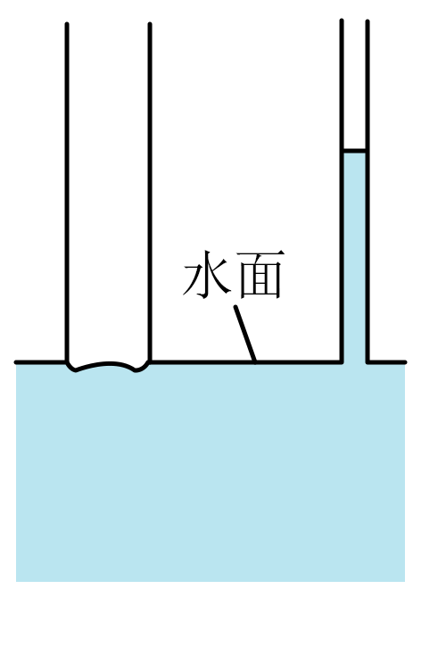

## 错法

因为水能附在玻璃上，就认为水在所有材料的细管里都会上升。错在只记液体名称，忽略固体界面及表面处理；同一种水面对不同管壁，可以形成相反的毛细升降。

## 正解

先确定“哪种液体—哪种固体—什么表面状态”，再看典型凹凸液面与相对高度。水浸润洁净玻璃，不浸润石蜡；水银与玻璃、铅的接触结果也不同。改材料会改浸润关系，改直径在其他条件相同时主要改升降幅度，不能把两者混为一谈。

## 例题

> 题目与解析：第二章  气体、固体和液体（专项训练）（解析版）.docx，来源ID S04，第88—99段。分段选取时保留该子问的完整题干、答案与解析；题目背景和原资料标注照录。

7．（24-25高二下·江西景德镇·期末）如图所示，将两根材质不同、粗细也不同的细管插入水中。一根细管中水面明显高于水槽水面，形成凹液面；另一根细管中水面略低于水槽水面，形成凸液面。则（　　）

A．两根细管中的液面不同是因为粗细差异导致的

B．细管越细毛细现象越明显

C．水浸润粗管

D．出现凹液面是因为水的表面张力，与毛细现象和浸润、不浸润无关

**原资料答案：** B

**原资料详解：** 

A．两根细管液面不同是因为浸润和不浸润以及表面张力导致的，不是粗细差异导致的，故A错误；

B．细管越细，毛细现象（液面上升或下降）越明显，故B正确；

C．形成凹液面的管是水浸润的，凸液面的管是水不浸润的，故水不浸润粗管，故C错误；

D．凹液面与毛细现象、浸润有关，是表面张力等共同作用，故D错误。

故选B。

### 顺着本题再看清一步

图中细管材料不同，一根上升、另一根下降，是反驳“同一液体总会同方向升降”的直接原题证据。原题B的“越细越明显”必须补上其他条件相同的边界。
