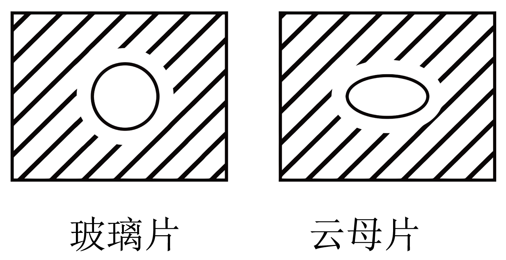

## 错法

把测得圆形熔化区，或不同方向导电性一样，直接翻译成“没有晶格，因此非晶体”。这把单个宏观测量当作内部结构的充分证据；随机取向的多晶体也会平均出各向同性。

## 正解

各向同性首先只描述测量结果。需要再找有无确定熔点、内部结构等独立证据。普通教材模型中，有确定熔点而整体各向同性可以是多晶体，无固定熔点而各向同性才支持非晶体。单晶体也不是每一种性质都一定各向异性。

## 例题

> 题目与解析：第二章  气体、固体和液体（专项训练）（解析版）.docx，来源ID S04，第32—42段。分段选取时保留该子问的完整题干、答案与解析；题目背景和原资料标注照录。

2．（24-25高二下·河北·期中）在玻璃片和云母片上分别涂上一层很薄的石蜡，然后用烧热的钢针去接触玻璃片及云母片的另一面，石蜡熔化区域的形状如图所示。则下列说法正确的是（　　）

A．玻璃片沿各个方向的导热性能不相同

B．云母片沿各个方向的导热性能相同

C．可以根据物理性质各向同性或各向异性来鉴别晶体和非晶体

D．物体表现为各向异性，是由于组成该物质的微粒在空间有规则地排列着

**原资料答案：** D

**原资料详解：** AB．玻璃片上石蜡的熔化区域呈圆形，说明玻璃片沿各个方向的导热性能相同；云母片上石蜡的熔化区域呈椭圆形，说明云母片沿各个方向的导热性能不相同，AB错误；

C．物理性质表现为各向同性的可以是多晶体，也可以是非晶体，故不能根据各向异性或各向同性来鉴别晶体和非晶体，故C错误；

D．物体表现为各向异性，是由于组成该物质的微粒在空间的排列是规则的，具有空间上的周期性，D正确。

故选D。

### 顺着本题再看清一步

A、B从图形可直接判断错误；C把同一个各向同性结果用于区分多晶体和非晶体，证据不够；D解释云母方向性。原题四项详解保留。
