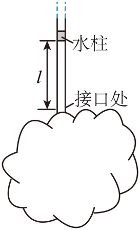

## 错法

把27℃升到37℃写成温度扩大37/27倍，再按这个倍数扩大体积。错在把摄氏零点当作比例式的自然零点；温度差能直接用℃，温度比不能。

## 正解

先转换$T_1=300\,\mathrm K$、$T_2=310\,\mathrm K$，再建立V/T或p/T。体积也要包含瓶内空间，不能只取管内长度。

温差在两温标中数值相同，因为$(t_2+273.15)-(t_1+273.15)=t_2-t_1$；但温度比$(t_2+273.15)/(t_1+273.15)$不等于$t_2/t_1$，所以零点偏移不能在相除时删除。

## 例题

> 题目与解析：专项01 气体、固体和液体（重难点训练）（解析版）.docx，来源ID S02，第56—73段。分段选取时保留该子问的完整题干、答案与解析；题目背景和原资料标注照录。

4．某实验小组为测量一个不规则物体的容积，将物体打开一个小口，在物体开口处竖直插入一根两端开口、内部横截面积为$0.1{cm}^{2}$的均匀透明长塑料管，密封好接口，用氮气排空不规则物体和塑料管内部气体，并用一小段水柱封闭氮气。外界温度为27℃时，塑料管内气柱长度为10cm；当外界温度缓慢升高到37℃时，气柱长度变为60cm。已知外界大气压恒为$1.0\times {10}^{5}Pa$，水柱长度不计。已知1mol氮气在$1.0\times {10}^{5}Pa$、0℃状态下的体积约为22.4L，阿伏伽德罗常数${N}_{A}$取$6.0\times {10}^{23}mol$。求：

(1)求物体的容积为多少毫升；

(2)试估算被封闭氮气分子的个数N（保留2位有效数字）。

**原资料答案：** (1)$149$

(2)$3.7\times {10}^{21}$

**原资料详解：** （1）设物体的容积为V，封闭气体的初、末态温度分别为${T}_{1}$、${T}_{2}$，体积分别为${V}_{1}$、${V}_{2}$

根据盖一吕萨克定律有$\frac{{V}_{1}}{{T}_{1}}=\frac{{V}_{2}}{{T}_{2}}$

其中${T}_{1}=300K$，${T}_{2}=310K$

又${V}_{1}=V+S{l}_{1}$，${V}_{2}=V+S{l}_{2}$

其中${l}_{1}=10cm$，${l}_{2}=60cm$

联立以上各式并代入题给数据得$V=149{cm}^{3}$

（2）设在$1.0\times {10}^{5}Pa$、273K状态下，1mol氮气的体积为${V}_{0}$、温度为${T}_{0}$，封闭气体的体积为${V}_{3}$，被封闭氮气的分子个数为N

根据盖-吕萨克定律$\frac{V+S{l}_{1}}{{T}_{1}}=\frac{{V}_{3}}{{T}_{0}}$

解得${V}_{3}=\frac{273}{2}{cm}^{3}$

温度、压强相同时，该1mol氮气的密度和被封闭气体的密度相同，故二者的质量之比等于体积之比，根据$n=\frac{m}{M}=\frac{N}{{N}_{A}}$

可知二者的物质的量之比即为质量之比，即为分子数之比，即二者的体积之比等于分子数之比，可得$N=\frac{{V}_{3}}{{V}_{0}}{N}_{A}$，其中${V}_{0}=22.4L$

联立以上各式并代入题给数据得$N=3.7\times {10}^{21}$

### 顺着本题再看清一步

原解析明确使用300 K与310 K，已经给出正确入口。149 cm³是容器容积，150 cm³才是初态气体体积，第二问标准状态体积136.5 cm³也要用完整气体计算。
