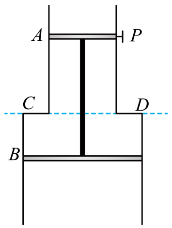

## 讲解

### 是什么

一定量气体在体积不变时，压强p与热力学温度T成正比：

$$\frac pT=C,\qquad \frac{p_1}{T_1}=\frac{p_2}{T_2}.$$

体积不变可以由刚性容器保证，也可以由销钉、卡环等把活塞固定在某处。这里p必须是绝对压强，不是压强表相对于外界的差值。

### 怎么来的

把状态方程$pV=nRT$两边除以VT，得到$p/T=nR/V$。固定n与V之后，右端不变，便得到查理定律。

微观上，在数密度不变的情况下升温，分子撞击器壁的平均动量传递增强，因此压强增大。销钉固定活塞时，销钉作用力可以随温度变化，不能仍要求气体压强刚好平衡大气压与活塞重力。

### 什么时候能用

体积固定的这段过程适用。销钉拔掉以后若活塞移动，就要重新判断过程，不能把拔钉前的等容条件延续过去。

下题第（2）问要求拔掉销钉后仍静止，因此先求“没有销钉作用力时刚好平衡”所需压强，再用拔钉前等容关系求对应温度。

## 例题

> 题目与解析：专项01 气体、固体和液体（重难点训练）（解析版）.docx，来源ID S02，第121—131段。分段选取时保留该子问的完整题干、答案与解析；题目背景和原资料标注照录。

7．如图所示，两端开口的导热汽缸竖直放置，用轻杆连接的A、B两活塞面积分别为$20{cm}^{2}$、$40{cm}^{2}$，质量分别为$0.5kg$、1kg。用销钉P将A栓住，环境温度为300K，封闭气体压强为$1\times {10}^{5}Pa$。已知大气压强${p}_{0}=1\times {10}^{5}Pa$，重力加速度大小g取$10\,\mathrm{m}/{s}^{2}$，不计一切摩擦，缸内气体可视为理想气体。

(1)当环境温度变为285K时，求封闭气体的压强。

(2)当环境温度变为多少时，拔掉销钉后活塞还能保持静止？

**原资料答案：** (1)$9.5\times {10}^{4}Pa$

(2)$277.5K$

**原资料详解：** （1）气体发生等容变化，由查理定律$\frac{{p}_{1}}{{T}_{1}}=\frac{{p}_{2}}{{T}_{2}}$

解得${p}_{2}=9.5\times {10}^{4}Pa$

（2）活塞静止时，分析 A、B受力${p}_{0}（{S}_{2}-{S}_{1})=({m}_{1}+{m}_{2}）g+{p}_{3}（{S}_{2}-{S}_{1}）$

气体发生等容变化，由查理定律$\frac{{p}_{1}}{{T}_{1}}=\frac{{p}_{3}}{{T}_{3}}$

解得${T}_{3}=277.5K$

### 顺着本题再看清一步

第一问体积被销钉固定，$p_2=10^5\times285/300=9.5\times10^4\,\mathrm{Pa}$。

第二问以A、B和杆为整体，气体对上活塞向上、对下活塞向下，合力是向下的$p_3(S_2-S_1)$；外界大气合力向上，为$p_0(S_2-S_1)$。因此

$$p_3=p_0-\frac{(m_1+m_2)g}{S_2-S_1}=92500\,\mathrm{Pa}.$$

再用$p_1/T_1=p_3/T_3$得$T_3=300\times92500/100000=277.5\,\mathrm K$。此时销钉的支持作用恰好不再需要。

## 易错

大气压相同不等于被封气体压强相同。双活塞面积不等，对整体的内外压力不能分别漏掉一块活塞。
