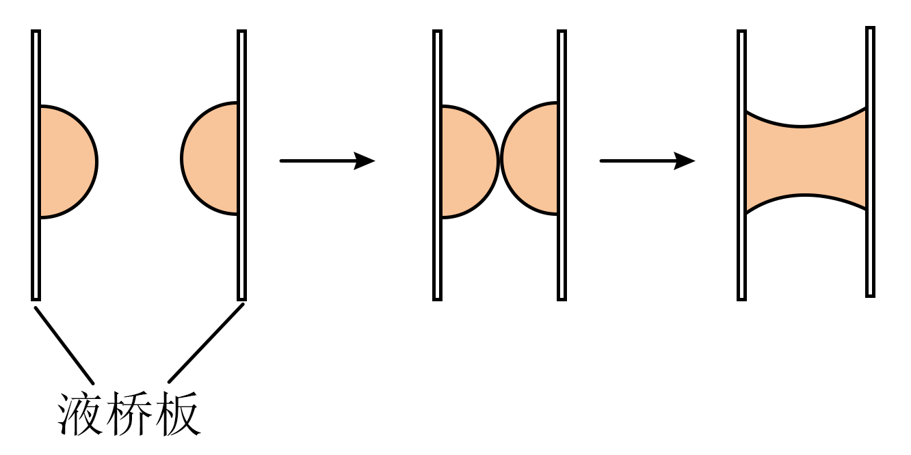

## 讲解

### 是什么

浸润是液体润湿并附着于某种固体表面的现象。它取决于液体、固体这一对材料及界面状态；同一种液体可能浸润一种材料，却不浸润另一种材料。

液体在细管内高于或低于外部液面的现象叫毛细现象。典型竖直细圆管中，浸润产生凹液面与上升，不浸润产生凸液面与下降。高度差是管内、管外自由液面的差，不是液柱从管底起算的总长度。

### 怎么来的

固体与液体之间的附着作用，以及液体内部的内聚作用，共同决定接触处的形状。液面在接触线附近倾斜，表面张力沿该处液面切向作用，形成向上或向下分量；液体上升或下降，直到相关压力与重量达到平衡。

因此毛细现象既需要界面性质，也受管径影响。相同材料、相同液体和温度下，管越细，给定接触周长能对应的液柱截面积越小，液面偏移越明显。

这是拓展，考试给出相关参数时可用：圆管半径r，接触角θ从液体一侧量起，静态平衡近似为$2\pi r\gamma\cos\theta=\rho g\pi r^2h$，约去$\pi r$后得$h=2\gamma\cos\theta/(\rho gr)$。θ小于90°时h为正，大于90°时h为负。

### 什么时候能用

典型洁净玻璃被水浸润，水银不浸润玻璃；实际污物、涂层会改变结果。要比较毛细升降幅度，必须控制液体、材质、温度等条件，只改变管径。

空间站中的水桥说明水与板之间有附着作用，并受到表面张力塑形；分子引力与斥力仍然同时存在。不能把没有明显重力变形理解成分子间作用消失。

## 例题

> 题目与解析：第二章  气体、固体和液体（专项训练）（解析版）.docx，来源ID S04，第76—87段。分段选取时保留该子问的完整题干、答案与解析；题目背景和原资料标注照录。

6．（24-25高二下·四川雅安·期末）如图所示，在中国空间站中，宇航员将水挤在两块液桥板上形成两个水球，液桥板合拢，两个水球融合在一起，再把两板慢慢拉开，水在两板间形成了一座“水桥”。则下列说法正确的是（    ）

A．水未浸润该透明板

B．水形成半球状是因为水表面存在张力

C．形成“水桥”时，水分子间只有引力作用

D．如果在地球上做该实验，“水桥”长度更长

**原资料答案：** B

**原资料详解：** 

A．由图可知，水浸润该透明板，选项A错误；

B．水形成半球状是因为水表面存在张力，选项B正确；

C．形成“水桥”时，水分子间既有引力又有斥力，但分子力表现为引力作用，选项C错误；

D．如果在地球上做该实验，由于水的重力作用，“水桥”长度会较短，选项D错误。

故选B。

## 易错

A与图示水对板的附着相反；C把合力表现为引力错说成只有引力；D忽略地面重力使液桥变形并更易断裂。液桥实际长度还受体积、板面、间距等条件影响，本题按相同装置比较。
