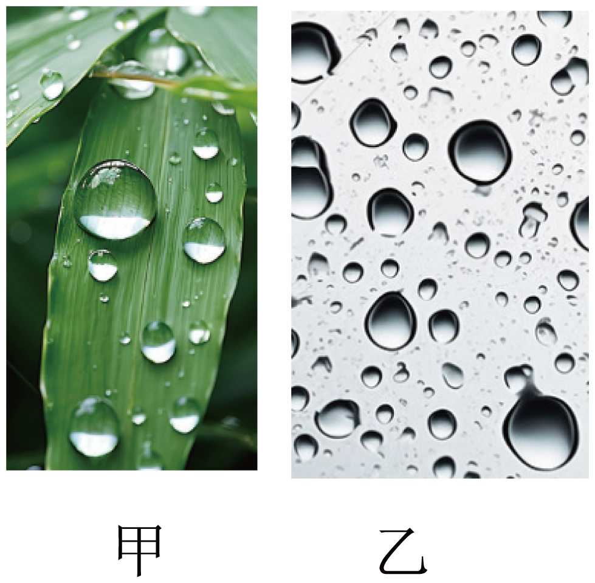

## 讲解

### 是什么

液体与气体交界的表面有收缩面积的趋势。沿液面画一条假想分界线，分界线一侧对另一侧的拉力沿液面切向、垂直这条分界线，叫表面张力。

表面张力系数记作γ，单位N/m。对一条长l的分界线，单个液面的拉力大小为$F=\gamma l$；γ取决于液体、温度和界面状态，不是总拉力F。

### 怎么来的

液体内部微粒周围有邻近微粒，表面微粒所处环境不对称。形成更多表面需要增加表面能，系统因此倾向减小表面积。教材用表面层分子间作用表现为吸引来解释这一收缩趋势；它不是说表面层只有引力而没有斥力。

相同体积的球具有最小表面积，所以小液滴在重力影响很小时接近球形。重力、与固体的接触和其他约束会使实际形状偏离完整球形。

这是拓展，考试涉及定量表面力时可用：肥皂薄膜有前后两个液面，长度l的活动边两面都拉它，合力为$2\gamma l$，不能与单界面混用。

### 什么时候能用

判断“为什么成团、为什么收缩”时先看液体表面；判断“为什么润湿某种固体”还要看液体与固体的相互作用。水滴附着玻璃不能仅归因于表面张力。

张力方向沿局部液面，不是始终水平或始终指向液滴中心；在弯曲液面上，局部方向不同，合力才可能具有向上或向内分量。概念核对见[OpenStax表面张力](https://openstax.org/books/college-physics-2e/pages/11-8-cohesion-and-adhesion-in-liquids-surface-tension-and-capillary-action)。

## 例题

> 题目与解析：第二章  气体、固体和液体（专项训练）（解析版）.docx，来源ID S04，第66—75段。分段选取时保留该子问的完整题干、答案与解析；题目背景和原资料标注照录。

5．（24-25高二下·江苏淮安·期末）如图甲所示，叶面上的露珠呈椭球形；如图乙所示，水滴附着在玻璃上。关于这两种现象，下列说法正确的是（　　）

A．露珠呈球形是由于水对叶面浸润

B．露珠呈球形是由于水的表面张力作用

C．水滴附着在玻璃上是由于水对玻璃不浸润

D．水滴附着在玻璃上是由于水的表面张力作用

**原资料答案：** B

**原资料详解：** AB．露珠呈球形，这是液体表面张力的结果，故A错误，B正确；

CD．水滴附着在玻璃上，这是水对玻璃浸润的结果，故CD错误。

故选B。

## 易错

A混淆成球与浸润；C把水对洁净玻璃的浸润说反；D把附着完全归给表面张力。本题B正确，但原照片中露珠受重力与叶面约束，可以呈椭球形而非严格球形。
