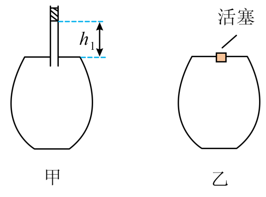

## 讲解

### 是什么

热平衡是两个系统在允许传热的接触条件下，最终没有净热量传递的状态。它们的温度相同；温度用来判断两系统能否达到热平衡，而不是直接比较它们储存的内能。

热平衡定律又叫热力学第零定律：若A与C分别达到热平衡，B与C也达到热平衡，那么A与B具有相同温度，可以彼此处于热平衡。

这里的“平衡”要看有无净传热。有两个温度恒定的物体，如果由外界持续维持温差且两者之间一直传热，那是稳定过程，不能仅凭温度读数不变说它们处于热平衡。

### 怎么来的

这条定律来自热现象的实验规律。它把“同温”变成可以传递的关系：C充当共同的比较标准，不必把A和B直接放在一起。

温度计利用的正是这一点。温度计先与被测物充分接触，达到热平衡后，温度计的示数才能代表被测物温度。拿到新环境就立刻读数，读到的可能主要还是温度计原来的温度。

下题把环境温度当成瓶中气体温度，隐含瓶壁导热、经过足够时间使气体与环境达到热平衡。这是把可测环境量变成气体状态量的依据。

### 什么时候能用

比较时要确认达到热平衡，且测量没有显著改变被测状态。温度相同的不同物体，质量、物质、物态可以不同，内能也可以不同。

有温差但完全隔热时，不发生传热不能证明同温。气体快速压缩后也可能暂时比环境热，不能立即把室温代入。定律的概念口径核对见[OpenStax温度与热平衡](https://openstax.org/books/university-physics-volume-2/pages/1-1-temperature-and-thermal-equilibrium)。

## 例题

> 题目与解析：专项01 气体、固体和液体（重难点训练）（解析版）.docx，来源ID S02，第45—47；49—49；51—52段。分段选取时保留该子问的完整题干、答案与解析；题目背景和原资料标注照录。

3．小华在家利用如图所示的装置通过简单易行的方法测量一个罐头瓶的体积。横截面积为S的吸管与罐头瓶的连接处气密性良好，细管中装有一小段水柱，如图甲所示。清晨时小华测出水柱下端到瓶盖处的高度（图甲中两虚线间距）为${h}_{1}$，从家中的温度计上读出环境的温度为${T}_{1}$。中午时再次测出上述两个物理量分别为${h}_{2}$和${T}_{2}$，两温度值均已换算成热力学温度。清晨时大气压为${p}_{0}$，瓶中气体可视为理想气体：

(1)若从清晨到中午大气压的变化可忽略不计，试估算罐头瓶的体积；

**原资料答案：** (1)$\frac{({T}_{1}{h}_{2}-{T}_{2}{h}_{1})S}{{T}_{2}-{T}_{1}}$

**原资料详解：** （1）从清晨到中午大气压的变化可忽略不计，则气体的压强一定，根据盖吕萨克定律有$\frac{{V}_{0}+{h}_{1}S}{{T}_{1}}=\frac{{V}_{0}+{h}_{2}S}{{T}_{2}}$

解得${V}_{0}=\frac{({T}_{1}{h}_{2}-{T}_{2}{h}_{1})S}{{T}_{2}-{T}_{1}}$

### 顺着本题再看清一步

原题不是单独考第零定律的选择题，本条保留原测量题，说明其测温前提。清晨和中午是两个各自达到热平衡的状态，不能因此说清晨和中午的温度相同。

## 易错

原资料要求读环境温度并估算瓶的容积；只有瓶内气体已与环境平衡，读数才可用。等温是一个过程条件，热平衡是状态关系，二者不是同一个词。
