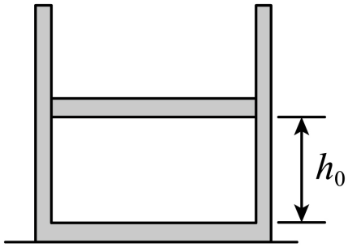

## 讲解

### 是什么

理想气体是忽略分子自身占据体积和分子间相互作用势能的气体模型，满足$pV=nRT$。p是绝对压强，V是占据的容器空间，n是物质的量，T是热力学温度，R是摩尔气体常量。

“忽略分子体积”不等于气体总体积为零；总体积指分子可以运动的空间。“忽略分子间作用”也不等于不与器壁碰撞，器壁受到的碰撞作用正是气体压强的来源。

### 怎么来的

真实气体比较稀薄、分子相距较远时，分子本身体积相对容器体积很小，分子间作用对宏观关系的影响也较小，才形成这一近似。气体实验定律可统一为状态方程。

对一定量、成分固定的理想气体，内能只随温度变化。单原子理想气体的经典模型给出$U=\frac32nRT$；一般分子的转动、振动等内部运动也可能贡献内能，不能对所有气体一律套该系数。此式按经典模型选取能量参考。

### 什么时候能用

高中题明确“视为理想气体”时可使用。实际气体接近凝结、高密度或高压状态时，近似可能失效；不能把“温度不低于某一个数、压强不超过某一个倍数”当成所有气体共同的严格阈值。

该模型约束状态关系，不能自动决定过程等温、等压或等容；过程条件还取决于容器、热交换、活塞受力。规范核对见[OpenStax理想气体定律](https://openstax.org/books/college-physics-2e/pages/13-3-the-ideal-gas-law)。

## 例题

> 题目与解析：专项01 气体、固体和液体（重难点训练）（解析版）.docx，来源ID S02，第132—145段。分段选取时保留该子问的完整题干、答案与解析；题目背景和原资料标注照录。

8．如图所示，固定的竖直气缸内有一个质量为$m$的活塞封闭着一定质量的理想气体，活塞横截面积为S，气缸内气体的初始热力学温度为${T}_{0}$，高度为${h}_{0}$，已知大气压强为${p}_{0}$，重力加速度为g。现对缸内气体缓慢加热，忽略活塞与气缸壁之间的摩擦。

(1)当气体的温度变为$1.5{T}_{0}$时，求活塞与气缸底部的距离h；

(2)气体的温度变为$1.5{T}_{0}$后，若缓慢将气缸顺时针旋转至开口水平向右，并保持气体的温度为$1.5{T}_{0}$不变，求过程结束时活塞与气缸底部的距离h′。

**原资料答案：** (1)$h=1.5{h}_{0}$

(2)${h}^{′}=1.5(1+\frac{mg}{{p}_{0}S}){h}_{0}$

**原资料详解：** （1）缸内的气体为等压变化，初态${V}_{1}=S{h}_{0}$，${T}_{1}={T}_{0}$

末态${V}_{2}=Sh$，${T}_{2}=1.5{T}_{0}$

由盖-吕萨克定律得$\frac{{V}_{1}}{{T}_{1}}=\frac{{V}_{2}}{{T}_{2}}$

联立解得$h=1.5{h}_{0}$

（2）缸内的气体为等温变化，初态${p}_{2}={p}_{0}+\frac{mg}{S}$，${V}_{2}=S⋅1.5{h}_{0}$

末态${p}_{3}={p}_{0}$，${V}_{3}=Sh'$

由玻意耳定律有${p}_{2}{V}_{2}={p}_{3}{V}_{3}$

得${h}^{′}=1.5(1+\frac{mg}{{p}_{0}S}){h}_{0}$

### 顺着本题再看清一步

原清单把真实气体与器壁的碰撞一概写成有动能损失，讲解没有沿用这一绝对说法。实际壁与气体间可以交换能量，平衡时净交换为零；理想弹性碰撞模型是对压强推导的简化。

## 易错

缓慢旋转气缸时温度按题意保持不变，但活塞重力沿气缸轴的分量改变，气体压强也改变。“理想气体”没有让这个过程变成等压。
